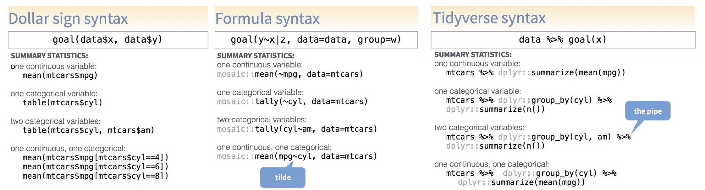
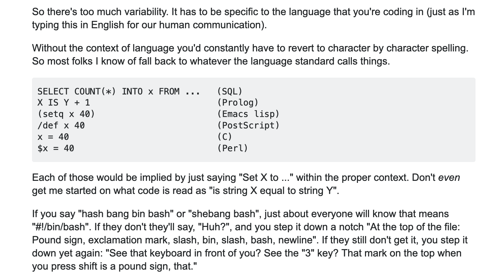
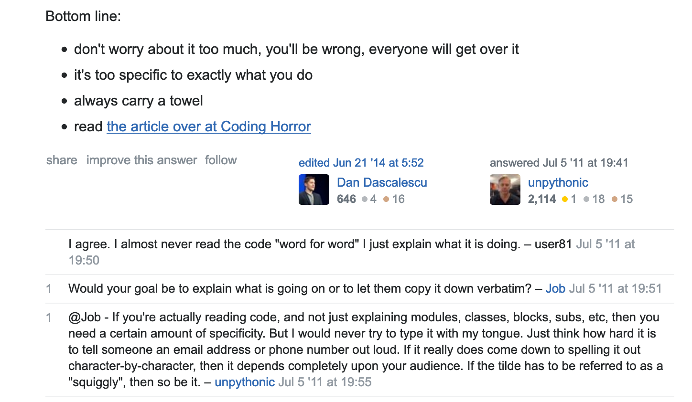
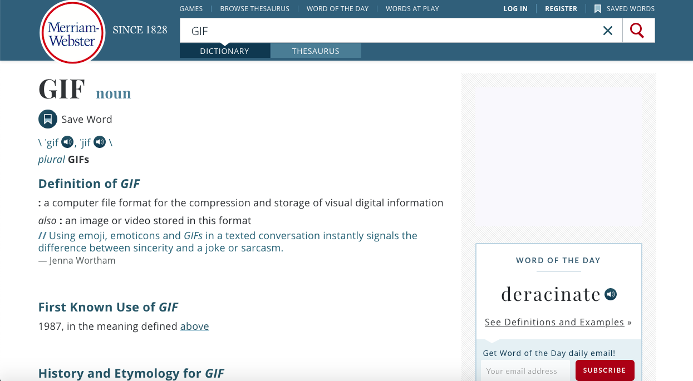
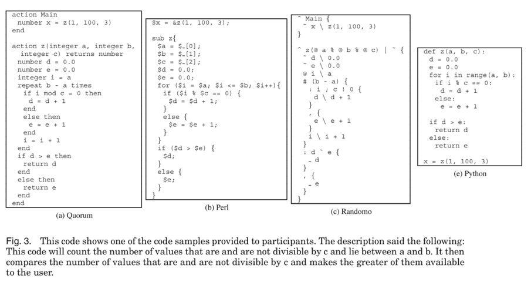
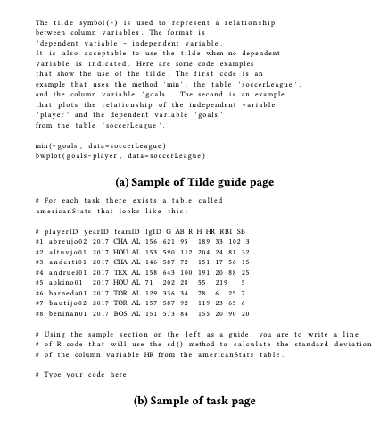
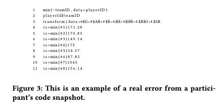
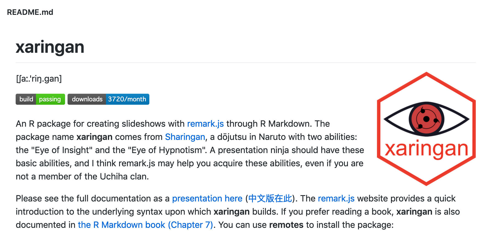
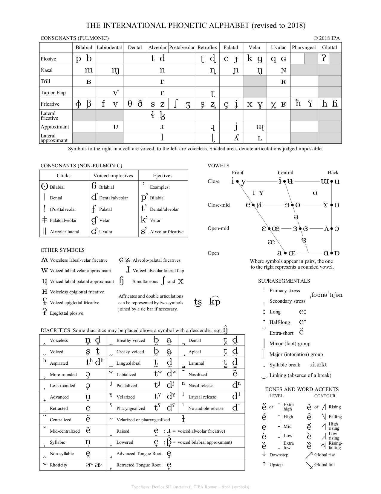

```{r setup, include=FALSE}
options(htmltools.dir.version = FALSE, warning = FALSE, message = FALSE, verbose = FALSE)
knitr::opts_chunk$set(echo = TRUE, message = FALSE, warning = FALSE, fig.retina = 3)

# devtools::install_github("rstudio/fontawesome")
# devtools::install_github("ropenscilabs/icon")
library(xaringan)
library(fontawesome)
```


class: title-slide, left, top
background-image: url(img/comments.png)
background-size: contain
background-position: bottom left 


# `r rmarkdown::metadata$title`

### `r rmarkdown::metadata$author`
### `r rmarkdown::metadata$role`
### `r rmarkdown::metadata$institute`

[`r icon::fa("twitter")` @AmeliaMN](https://twitter.com/AmeliaMN)  
[`r icon::fa("github")` AmeliaMN](www.github.com/AmeliaMN)  


???

Hi, I'm Amelia McNamara. I'm an assistant professor at the University of St Thomas in Minnesota. I tweet at AmeliaMN, which is a double entendre because my last name is McNamara and I live in Minnesota. I just tweeted a link to these slides if you want to follow along. 

- Statistics professor
- Teacher of R
    - high school students
    - high school teachers
    - college students
    - data science professionals
    - other statisticians

---
background-image: url(img/mpls-stp-8.5x11-DakotaMap.jpg)
background-size: cover
background-position: top left


.footnote[
 Dakota landmap by [Marlena Myles](https://marlenamyl.es/) 
]

???

Even though we're at a virtual conference, I want us to take a moment to consider the physical space we are each in, and the history of that space. The United States is built on land forcibly taken from Native Americans, and where I am physically located is no different. What is now called Minneapolis and St Paul was originally Dakota land, and continues to have a vibrant Native community. 

I chose this beautiful map of sites in the Twin Cities, labeled in the Dakota language, to show you where I'm physically grounded, and the idea of language is one I'm going to take into my talk.

---
class: big-bullet
# Big ideas
```{r, echo=TRUE, eval=FALSE}
lm(bill_length_mm ~ flipper_length_mm, data = penguins)
```
.pull-left[
- code is language
- specifically, R code is language
- consistency is key
- code should be speakable
- there are levels of verbalization for code
- words are easy, symbols are hard
- we need a style guide for speaking R
]
.pull-right[
```{r, echo=FALSE, fig.cap="Drawing of three species of penguins to accompany the penguins data by Allison Horst"}
knitr::include_graphics("img/lter_penguins.png")
```
]

.footnote[[Penguin data](https://github.com/allisonhorst/palmerpenguins) and [penguin art](https://github.com/allisonhorst/palmerpenguins/tree/master/man/figures) by [Allison Horst](https://twitter.com/allison_horst)
]


???
In particular, I am interested in the idea of code as language. I'm a teacher, and have taught thousands of people how to program, mostly in R. So, I'm interested in how best to teach people programming languages, as well as how thinking of code as a language can help everyone (even experts) be more productive. 

---
name: cheatsheet
class: center, middle
background-image: url(img/Syntax-cheatsheet.jpg)
background-size: contain

.footnote[
Syntax cheatsheet available from the RStudio [contributed cheatsheets](https://rstudio.com/resources/cheatsheets/#contributed-cheatsheets) page
]

???
I'm going to be talking a lot about R code, and how it is like human language. Like many languages, R has different dialects, and when learning the language it's best to stick to just one. 

I think of three main R dialects (call them syntaxes or DSLs), so I made this cheatsheet for my students to show them what the other syntaxes look like. 

data.table is not on here, because I don't know how to do data.table visualizations or data.table summary statistics. If you want to implement these same tasks in data.table and send them to me, I'd love to see them! 

---
class: middle

.footnote[
Syntax cheatsheet available from the RStudio [contributed cheatsheets](https://rstudio.com/resources/cheatsheets/#contributed-cheatsheets) page
]

???

Of course, practitioners really mix and match the syntaxes shown here, and more, when they are working. But, this has been useful to show students which "column" we are working in, and what the other approaches are. 

I'm interested in how the different syntaxes may impact learning, and whether they lead to different conceptions of data. 

---
class: top
background-image: url(img/LanguageTED.png)
background-size: contain
background-position: top center

.footnote[
 Lera Boroditsky, "How language shapes the way we think" ([video](http://bit.ly/LanguageShapesThinking))]

???
We know human language shapes our thinking, so why should programming languages be different? 

---
name: KAMSC
class: big-bullet
### Key Attributes of a Modern Statistical Computing Tool


.footnote[McNamara, A. Key Attributes of a Modern Statistical Computing Tool. [The American Statistician, Volume 73, Issue 4. 2019](https://www.tandfonline.com/doi/abs/10.1080/00031305.2018.1482784). Or, [free pre-print on arXiv](https://arxiv.org/abs/1610.00985).
]

{{content}}


---
template: KAMSC

- Accessibility
- Easy entry for novice users
- Data as a first/order persistent object
- Support for a cycle of exploratory and confirmatory analysis
- Flexible plot creation
- Support for randomization throughout
- Interactivity at every level
- Inherent documentation
- Simple support for narrative, publishing, and reproducibility
- Flexibility to build extensions

???
Last year, I published a paper in The American Statistician, based on my dissertation research. In it, I outline an updated set of attributes for a statistical computing tool. I was inspired by the work of John Tukey in the 1960s, and Rolf Biehler, in the 1990s, both of whom thought about how our statistical interfaces could make us more productive, and how they could better support students. 

There are 10 attributes, and not all of them are related to speaking code out loud, but several are. 


---
template: KAMSC

- **Accessibility**
- Easy entry for novice users
- Data as a first/order persistent object
- Support for a cycle of exploratory and confirmatory analysis
- Flexible plot creation
- Support for randomization throughout
- Interactivity at every level
- Inherent documentation
- Simple support for narrative, publishing, and reproducibility
- Flexibility to build extensions

???

Accessibility means that a tool needs to be free, or very cheap. It needs to be able to be installed on a variety of operating systems. And, it needs to work for all sorts of people. 

---
template: KAMSC

- Accessibility
- **Easy entry for novice users**
- Data as a first/order persistent object
- Support for a cycle of exploratory and confirmatory analysis
- Flexible plot creation
- Support for randomization throughout
- Interactivity at every level
- Inherent documentation
- Simple support for narrative, publishing, and reproducibility
- Flexibility to build extensions

???
Easy entry for novices is about getting started using a tool. This is also called "low threshold." It's important to have something that people can get into. 

---
template: KAMSC

- Accessibility
- Easy entry for novice users
- Data as a first/order persistent object
- Support for a cycle of exploratory and confirmatory analysis
- Flexible plot creation
- Support for randomization throughout
- Interactivity at every level
- **Inherent documentation**
- Simple support for narrative, publishing, and reproducibility
- Flexibility to build extensions

???
The most relevant to speaking code out loud is "inherent documentation." Essentially, this means that a tool should make it clear what it is doing. In a Graphical User Interface, that might mean an icon or animation that visually shows what a button does. In a programming language, it means language attributes that closely mimic human language. 

---
template: KAMSC

- Accessibility
- Easy entry for novice users
- Data as a first/order persistent object
- Support for a cycle of exploratory and confirmatory analysis
- Flexible plot creation
- Support for randomization throughout
- Interactivity at every level
- Inherent documentation
- Simple support for narrative, publishing, and reproducibility
- **Flexibility to build extensions**

???
Finally, a tool needs to have the flexibility to build extensions. CS ed researchers call this a "high ceiling." Novices should not age-out or experience-out. 

I'm probably already losing some of you, because you are not interested in teaching and learning. But, I believe these concepts can also help you work more efficiently. If programmers are spending time trying to speed up their typing speeds, maybe they can spend some time thinking about other ways in which their 

If you need to debug or pair program from afar, you may need to speak about your code over the phone or video conferencing

If you make code that is speakable, that may increase the use of your packages. 

---
layout: false
class: center, middle
# Accessibility 

---
class: middle
# Universal design 

> "Universal Design is the design and composition of an environment so that it can be accessed, understood and used to the greatest extent possible by all people regardless of their age, size, ability or disability."

> "An environment (or any building, product, or service in that environment) should be designed to meet the needs of all people who wish to use it."

.footnote[What is Universal Design? [Centre for Excellence in Universal Design](http://universaldesign.ie/What-is-Universal-Design/)
]

???

Some people can't see. Some people can't type


---
class: big-bullet
# People who can't type

Two main strategies:
- Speak to the computer:
    - Naomi Saphra, ["What Does a Coder Do If They Can't Type?"](http://nsaphra.github.io/post/hands/)
    - Emily Shea, ["Perl Out Loud"](https://www.youtube.com/watch?v=Mz3JeYfBTcY)
- Speak to another person: 
    - Ian Gilman, ["Wrists & Apprentices"](https://blog.iangilman.com/2018/06/wrists-apprentices.html)

"By the time I was 20 I had developed a chronic wrist injury that I still have decades later. Maybe I should have walked away from computers, but by then I was hooked! That was a dark time, but eventually I struck upon a solution... I could dictate my code to someone else who could be my hands." - Ian Gilman

???


---
class: big-bullet
# People who can't see

Main strategy:
- have the computer speak to you
    - Jonathan Godfrey and Thodor Loots. "Statistical Software (R, SAS, SPSS, and Minitab) for Blind Students and Practitioners" [JSS, Volume 58 Software Review 1](https://www.jstatsoft.org/article/view/v058s01). 2013.
    - Jonathan Godfrey, [Statistical software and blind users](https://r-resources.massey.ac.nz/StatSoftware/) (tl;dr R is best, but could be better)
    - Jonathan Godfrey, [Interactive graphs for blind and print disabled people](https://www.youtube.com/watch?v=E1wS-sK2RLs) useR! 2017 ("SAS is catching up")

.footnote[I guess I'm saying, check out [Dr. Jonathan Godfrey's work](https://www.massey.ac.nz/massey/expertise/profile.cfm?stref=416430)
]

???

Blind folks use screen readers, which read code outloud to them. I know people do this for all programming languages, but I'm most familiar with R. 

RStudio used to not be accessible, now is minimally accessible. But, R itself is good. 

I don't know much about how Deaf folks learn to read. 

---
class: big-bullet
# English as the language of computing

- C
- Java
- Python
- C++
- C#
- Visual Basic
- JavaScript
- R
- PHP
- Swift

.footnote[Top 10 programming languages for July 2020, [TIOBE Index](https://www.tiobe.com/tiobe-index/) ([Commentary by Hadley Wickham](https://twitter.com/hadleywickham/status/1279405379449913344?s=20))
]

???
Of course, even this seemingly-uncontroversial statement is loaded with implicit cultural implications, most specifically about what is "inherently" clear about English. The top ten programming languages in the TIOBE index are all based on English, and there are very few programming languages based in other languages. 

So, "clear for whom" is obviously a question.

And, there is likely intersectionality. If you are blind and your first language isn't English, likely to be doubly hard. 


---
class: center, middle
# Ease of entry


---
class: big-bullet
## `r icon::fa("chalkboard-teacher")` How to teach programming (and other things)

- Minimal guidance does not work
- There is research about how people learn!
- Not enough debate in CS education
- Teach people how to read out loud
- Silent reading comes later


.footnote[
Felienne’s rstudio::conf 2019 keynote, Explicit Direct Instruction in Programming Education ([video](https://resources.rstudio.com/rstudio-conf-2019/opening-keynote-day2)), <br> Alaaeddin Swidan and Felienne Hermans. The Effect of Reading Code Aloud on Comprehension: An Empirical Study with School Students [CompEd '19: Proceedings of the ACM Conference on Global Computing Education](https://dl.acm.org/doi/10.1145/3300115.3309504)
]


???
I found Felienne's 2019 keynote at rstudio::conf extremely inspiring. In particular, one of her takeaways was how verbalizing code helps people learn better. She drew on the literature of [linguistics], and has done some studies on having students read code out loud. This was already something I was doing in my teaching, but I immediately became even more dedicated to it.

---
# Carpentries 


### `r icon::fa("award")` Teach the most useful thing first 
### `r icon::fa("brain")` Reduce cognitive load 
### `r icon::fa("keyboard")` Don't touch the learner's keyboard 
### `r icon::fa("volume-up")` Verbalize what you are doing 

.footnote[[The Carpentries](https://carpentries.org/) is a global non-profit with the goal of increasing access to computational and data skills. You can become a certified [Instructor](https://carpentries.org/become-instructor/) by taking their training. 
Mine Çetinkaya-Rundel's [data science in a box](https://datasciencebox.org/hello/design-principles/) follows these principles, including "start with cake."
]

???
In the summer of 2019, I had the opportunity to get Carpentries certified, where I beefed up on data-driven practices for teaching coding, one of which is "don't touch the learners keyboard" and another is "verbalize what you are doing." 

These two practices go hand in hand, particularly when you're debugging code.

And, they tie in with what Felienne was saying. If we are going to start with "sounding out" code, students will have fewer objects to hold in their working memory. 

---
# Pair programming 

.center[
<iframe width="800" height="500"  src="https://www.youtube.com/embed/vgkahOzFH2Q" frameborder="0" allow="accelerometer; autoplay; encrypted-media; gyroscope; picture-in-picture" allowfullscreen></iframe>
]

.footnote[[Pair programming](https://www.youtube.com/watch?v=vgkahOzFH2Q)
]

???
One person "drives" (hands on keyboard), and the other "navigates" (helps guide). 

Common in computer science education, reminds me of Gilman's wrists and apprentices


---
class: center, middle

# Inherent documentation

---
# Some R function pronunciations are clear

```{r, eval=FALSE}
mean()
summary()
help()
paste()
```

???

Again, remembering that this is based on English

---
# Others are... less so 
.pull-left[
## str()

```{r, eval=FALSE}
str(penguins)
```

- "ess tee arr penguins"
- "stir penguins"
]

.pull-right[
## runif()

```{r}
runif(4)
```

- "run-if four" (Nope!)
- "r unif four" (Yep!)

`randunif` might have been better
]

???
Trying to save characters...

tapply, sqrt


---
# "Standards for reading code out loud?"


```{r, echo=FALSE, out.width='75%', fig.align='center', fig.cap="Screenshot of StackExchange post about standards for reading code outloud. Text in footnote of this slide."}

```


.footnote[[https://softwareengineering.stackexchange.com/questions/89833/standards-for-reading-code-out-loud](https://softwareengineering.stackexchange.com/questions/89833/standards-for-reading-code-out-loud)
]

???
"If you say "hash bang bin bash" or "shebang bash", just about everyone will know that means "#!/bin/bash". If they don't they'll say, "Huh?", and you step it down a notch "At the top of the file: Pound sign, exclamation mark, slash, bin, slash, bash, newline". If they still don't get it, you step it down yet again: "See that keyboard in front of you? See the "3" key? That mark on the top when you press shift is a pound sign, that.""

---
# "Standards for reading code out loud?"

```{r, echo=FALSE, out.width='75%', fig.align='center', fig.cap="Screenshot of StackExchange post about standards for reading code outloud. Text in footnote of this slide."}

```

.footnote[[https://softwareengineering.stackexchange.com/questions/89833/standards-for-reading-code-out-loud](https://softwareengineering.stackexchange.com/questions/89833/standards-for-reading-code-out-loud)
]

???
"I agree. I almost never read the code "word for word" I just explain what it is doing [...] But I would never try to type it with my tongue"

I'll bring in the codinghorror page later. 

There are levels of verbalization for code
 

---
class: center, middle

# speaking R


---
# Assignment operators

.pull-left[
```{r, echo=TRUE}
a <- 4
```

- "a gets four" 
- "a is four"
- "set a to 4"] 

.pull-right[
```{r}
a = 4
```

- "a equal four"
- "a is four"
- "a gets four"
]

In tidyverse syntax, perhaps the right assignment operator makes more sense,

```{r, echo=FALSE}
# install.packages("remotes")
# remotes::install_github("allisonhorst/palmerpenguins")
library(dplyr)
```

```{r, eval=FALSE}
penguins %>%
  head() ->
first_penguins
```

- "into"?
- "gives"?


???
Okay, so maybe I've convinced you that we should be verbalizing code (either out loud, or at least in our heads), and that it would be good to be consistent. But, there are so many inconsistencies in how things are pronounced in R!

Right assignment operator?

"Participants in both groups followed some of the instructed vocalizations more frequently such as the variable's assignment (is)." Alaaeddin Swidan and Felienne Hermans. The Effect of Reading Code Aloud on Comprehension: An Empirical Study with School Students [CompEd '19: Proceedings of the ACM Conference on Global Computing Education](https://dl.acm.org/doi/10.1145/3300115.3309504))

---
# Sadly, I can't tell you "the" answer

- LaTeX 
- gif


.footnote[
Merriam-Webster [entry for the word gif](https://www.merriam-webster.com/dictionary/GIF)
]
???
I say "lay-tech" and "gif" but there are many other accepted pronunciations. Most important thing is consistency. 

---
class: middle
>It’s a language for data analysis. And if you think that the language is a little incoherent, a little confusing, a bit of a maze, well then all I have to say is welcome to data analysis.

> - Roger Peng, [useR 2018 keynote](https://www.youtube.com/watch?v=5033jBHFiHE)


---
class: big-bullet
# ASCII characters

Sometimes, we just say the name of the ASCII character, but sometimes it has additional meaning in R.

.footnote[[ASCII Pronunciation Rules for Programmers](https://blog.codinghorror.com/ascii-pronunciation-rules-for-programmers/)]


- **"** quotation mark

--

- **$** dollar sign

--

- **!** exclamation mark, or "not"

--

- **#** pound sign, number sign, or "comment"

--

- **~** tilde, twiddle, or "by"

--

- **|** bar, vertical bar, vbar, or "or"


???

Here's the coding horror reference 

comes back to levels of verbalization


---
class: big-bullet
# parentheses

```{r, eval=FALSE}
head(penguins)
```

- "head open paren penguins close paren"
- "head left paren penguins right paren"
- function notation, $f(x)$, "f of x"
- "head of penguins"

---
# Functions that work well this way 

## lm()

```{r, echo=TRUE, eval=FALSE}
lm(bill_length_mm ~ flipper_length_mm, data = penguins)
```

## plot()
```{r plotpenguin1, eval=FALSE}
plot(penguins$bill_length_mm, penguins$flipper_length_mm)
plot(flipper_length_mm ~ bill_length_mm, data = penguins)
```

???

"el em of em pee gee by double u tee, data equals em tee cars"

---
# Less effective as things get more verbose

```{r, echo=TRUE, eval=FALSE}
summary(lm(bill_length_mm ~ flipper_length_mm, data = penguins))

m1 <- lm(bill_length_mm ~ flipper_length_mm, data = penguins)
summary(m1)
```

Much like $f(g(h(x)))$

???

This is more efficient, like Luke Tierney was saying in his keynote, but I don't think it's as readable. 

Even with the two-line approach, you need to figure out what `m1` refers to, almost like determining what a pronoun refers to in human language. In essence, you're doing the nesting yourself. 


---
class: big-bullet
# %>%

```{r, echo=FALSE}
library(tidyverse)
```

```{r, eval=FALSE}
penguins %>%
  head()
```

- "percent greater than percent"
- "pipe"
- "then"
- "penguins then head"

???

Idea for pronunciation may have come from Heike. 
I struggle because I don't know how to say a line break. 


---
# %>%'s power comes from longer pipelines

```{r, eval=FALSE}
foo_foo <- little_bunny()

bop_on(
  scoop_up(
    hop_through(foo_foo, forest),
    field_mouse
  ),
  head
)

# vs

foo_foo %>%
  hop_through(forest) %>%
  scoop_up(field_mouse) %>%
  bop_on(head)
```


.footnote[Via Hadley Wickham's [Data Science with R](https://www.youtube.com/watch?v=K-ss_ag2k9E). Reed College, 2016.]

???

Less efficient in compute time, more efficient in human brains

---
smart: false
# "Ceci n'est pas un pipe"

**|** is often thought of as "the pipe" (as in unix), but we use that symbol to mean "or" in R. 

```{r, eval=FALSE}
penguins %>%
  filter(species == "Adelie" | bill_length_mm > 50)
```

.pull-left[
```{r, echo=FALSE, out.width='50%', fig.cap="magrittr hex sticker, with %>% operator"}
knitr::include_graphics("img/pipe.png")
```
]
.pull-right[
```{r, echo=FALSE, out.width='110%', fig.cap="Rene Magritte's painting, The Treachery of Images"}
knitr::include_graphics("img/MagrittePipe.jpg")
```
]

.footnote[[maggritr package](https://magrittr.tidyverse.org/), René Magritte's [The Treachery of Images](https://en.wikipedia.org/wiki/The_Treachery_of_Images)]

???
In his keynote yesterday, Luke Tierney talked about the possible addition of **|>** as a pipe in base R!

---
class: center, middle

# What makes learning language hard?

---
## homonyms, homophones, and homographs

.pull-left[
## homophones

Pronounced the same, spelled differently, different meanings. 
- pear/pair
- week/weak
- meet/meat
- sea/see


]

.pull-right[
## homographs

Spelled the same, different pronunciation, different meaning.

- bass
- buffet
- tear

]

.footnote[gif from <a href="https://en.wikipedia.org/wiki/The_Beginning_of_the_End_(30_Rock)">30 Rock</a>
]

???
Homonyms can be either homophones or homographs. A more restrictive definition says they need to be **both**-- spelled the same, pronounced the same, different meanings. 

Bass drum, go fishing and catch a bass.
Eat at the buffet, get buffeted about
A tear ran down my face because I got a tear in my dress

Felienne mentioned these in her keynote, too. 


---
# R homophones and homographs

I have a habit of saying "then" to mean both `%>%` and "linebreak." Those both get pronounced the same, but are spelled very differently, and have different meanings.  

The vbar `|` is usually  "or"
```{r, eval=FALSE}
penguins %>%
  filter(species == "Chinstrap" | bill_length_mm > 50)
```

but in formula syntax, it takes on another meaning, "given."

```{r, eval=FALSE}
gf_point(bill_length_mm ~ flipper_length_mm | sex, data = penguins)
```

---
# R homophones and homographs

Periods are homonyms-- they sometimes they indicate a method, 
```{r, eval=FALSE}
plot.dendrogram()
plot.factor()
plot.lm()
as.character()
data.frame()
```

and sometimes are just delimiters,

```{r, eval=FALSE}
read.csv()
contrib.url()
```


???
as.character, plot.data.frame, plot.dendrogram, etc. 

Usually read "dot." 

Homophone-- "then." Spelled differently, different meanings
Homograph-- vbar. Spelled the same, but different meanings

---
class: big-bullet
# silent characters

In English, silent letters show up in words like debt, hustle, knight, and many more. In R, there are characters we rarely pronounce.

```{r, eval=FALSE}
lm(bill_length_mm ~ flipper_length_mm, data = penguins)
```
.pull-left[
- close paren 
- commas
- spaces 
- linebreaks
]
.pull-right[
- square brackets 
```{r, eval=FALSE}
letters[4]
```
- periods
- underscores
```{r, eval=FALSE}
read.csv()
read_csv()
```
]


???
Sometimes, people don't say characters that appear on the screen. I have heard both pronounced as "read cee ess vee"

"Vocalizing the indentation spaces in a for-loop was among the least followed." Alaaeddin Swidan and Felienne Hermans. The Effect of Reading Code Aloud on Comprehension: An Empirical Study with School Students [CompEd '19: Proceedings of the ACM Conference on Global Computing Education](https://dl.acm.org/doi/10.1145/3300115.3309504)


---
# Style

We have style guides for written code, but no style guides for verbal code (yet!). Since the best practice for object names is snake case, we need a way to pronounce the underscore.

```{r, eval=FALSE}
penguins$bill_length_mm
```
.pull-right[
<iframe width="504" height="315" src="https://www.youtube.com/embed/xJiHlt8NRqk?start=72" frameborder="0" allow="accelerometer; autoPlay="1"; mute="1"; encrypted-media; gyroscope; picture-in-picture" allowfullscreen></iframe>
]

.footnote[[tidyverse style guide](https://style.tidyverse.org/), Victor Borge, [Phonetic Punctuation](https://www.youtube.com/embed/xJiHlt8NRqk)
]

???
"It was derived from Google’s original R Style Guide - but Google’s current guide is derived from the tidyverse style guide."

No good way to pronounce capital letters, so camel case isn't better for verbalization

---
class: center, middle

# syntax

???

So, one way to judge a programming language, syntax, or DSL, is by it's "speakability." 


---
```{r, echo=FALSE, out.width='95%', fig.cap="Figure from Stefik's paper, comparing Quorum, Perl, Randomo, and Python code for the same task"}

```


.footnote[C-style languages (Perl, Java) were no better than Randomo, but non-C-style (Quorum, Python, Ruby) were. <br> Andreas Stefik and Susanna Siebert.  An Empirical Investigation into Programming Language Syntax. [ACM Transactions on Computing Education, Volume 13 Number 4, 2013](https://dl.acm.org/doi/10.1145/2534973) ]

???

For this article, we conducted **four empirical studies on programming language syntax** as part of a larger analysis [...] two surveys [...] on the intuitiveness of syntax,  two studies on the accuracy rates of novices using a total of six programming languages: Ruby, Java, Perl, Python, Randomo, and Quorum. Randomo was designed by randomly choosing some keywords from the ASCII table (a metaphorical placebo). To our surprise, **we found that languages using a more traditional C-style syntax** (both Perl and Java) **did not afford accuracy rates significantly higher than a language with randomly generated keywords**, **but that languages which deviate** (Quorum, Python, and Ruby) **did**.

---
# data8 exercise 1 (python)

```{python, echo=TRUE, eval = FALSE, python.reticulate=FALSE}
# Count how many times the names Jim, Tom, and Huck appear in each chapter.

counts = Table().with_columns([
        'Jim', np.char.count(huck_finn_chapters, 'Jim'),
        'Tom', np.char.count(huck_finn_chapters, 'Tom'),
        'Huck', np.char.count(huck_finn_chapters, 'Huck')
    ])

# Plot the cumulative counts:
# how many times in Chapter 1, how many times in Chapters 1 and 2, and so on.

cum_counts = counts.cumsum().with_column('Chapter', np.arange(1, 44, 1)) #<<
cum_counts.plot(column_for_xticks=3)
plots.title('Cumulative Number of Times Each Name Appears', y=1.08);
```


.footnote[[data8.org](http://data8.org/), 
[data8 lesson 1.3](https://www.inferentialthinking.com/chapters/01/3/Plotting_the_Classics.html)
]

???

Data8 may be the largest data science class ever. Thousands of students take the course in person at UC Berkeley, thousands more on edX

I'm not going to read you all this code. It takes a long time to get through. In a pedagogical setting, that time is not "wasted"-- it's necessary! But I don't think you need me to do it today. 

Looks like arrange is misspelled, but it's actually "a range." 

---
# Exercise ported to tidyverse R

```{r, echo=TRUE, eval=FALSE}
# Count how many times the names Jim, Tom, and Huck appear in each chapter.

counts <- huck_finn_chapters %>%
  filter(word %in% c("jim", "tom", "huck")) %>%
  group_by(chapter, word) %>%
  summarize(count = n())

# Plot the cumulative counts:
# how many times in Chapter 1, how many times in Chapters 1 and 2, and so on.

cum_counts <- counts %>%
  group_by(word) %>%
  mutate(cumulativesum = cumsum(count))

ggplot(cum_counts) +
  geom_line(aes(x = chapter, y = cumulativesum, color = word)) +
  ggtitle("Cumulative Number of Times Each Name Appears")
```

???

Similarly, not going to read all this code to you. But, I think it is much more readable. 

I wouldn't start with this exercise for novices!! 

---
template: cheatsheet

???
>"Less volume, more creativity."

> -Mike McCarthy / mosaic package philosophy


---
# Summary statistics three ways

**base**
```{r, echo=TRUE, eval=FALSE}
mean(penguins$body_mass_g[penguins$species == "Adelie"])
mean(penguins$body_mass_g[penguins$species == "Chinstrap"])
mean(penguins$body_mass_g[penguins$species == "Gentoo"])

tapply(penguins$body_mass_g, penguins$species, mean)
```

**formula**
```{r, echo=TRUE, eval=FALSE}
mean(body_mass_g ~ species, data = penguins)
```

**tidyverse**
```{r, echo=TRUE, eval=FALSE}
penguins %>%
  group_by(species) %>%
  summarize(mean(body_mass_g))
```


???
The GAISE guidelines say "Give students experience with multivariable thinking." [GAISE guidelines](https://www.amstat.org/asa/education/Guidelines-for-Assessment-and-Instruction-in-Statistics-Education-Reports.aspx), for PreK-12, and college. Harder in base!

---
# Scatterplot three ways

**base**
```{r, echo = TRUE, eval=FALSE}
plot(penguins$flipper_length_mm, penguins$bill_length_mm)
```

**formula**
```{r, echo = TRUE, eval=FALSE}
xyplot(bill_length_mm ~ flipper_length_mm, data = penguins)

gf_point(bill_length_mm ~ flipper_length_mm, data = penguins)
```

**tidyverse**
```{r, echo = TRUE, eval=FALSE}
ggplot(penguins) +
  geom_point(aes(x = flipper_length_mm, y = bill_length_mm))
```


---
# Sets of scatterplots three ways


**base**
```{r, echo = TRUE, eval = FALSE}
par(mfrow = c(1, 3))
plot(penguins$flipper_length_mm[penguins$species == "Adelie"], penguins$bill_length_mm[penguins$species == "Adelie"])
plot(penguins$flipper_length_mm[penguins$species == "Chinstrap"], penguins$bill_length_mm[penguins$species == "Chinstrap"])
plot(penguins$flipper_length_mm[penguins$species == "Gentoo"], penguins$bill_length_mm[penguins$species == "Gentoo"])
# apply solution?
```

**formula**
```{r, echo = TRUE, eval=FALSE}
gf_point(bill_length_mm ~ flipper_length_mm | species, data = penguins)
```

**tidyverse**
```{r, echo = TRUE, eval=FALSE}
ggplot(penguins, aes(x = flipper_length_mm, y = bill_length_mm)) +
  geom_point() +
  facet_grid(~species)
```


???
In programming, if you are repeating yourself a lot, that probably means you can be more efficient.

If you're speaking code, it gets especially tedious to repeat yourself!


---

.pull-left[
```{r, echo=FALSE, out.width='150%', fig.cap="Figure from Rafalinski's paper, showing the setup to the experiment for the formula syntax, and an example of the task"}

```
]
.pull-right[
```{r, echo=FALSE, out.width='150%', fig.cap="Figure from Rafalinski's paper, showing a variety of student errors for the task in the previous figure."}

```
]


.footnote[Timothy Rafalski, P. Merlin Uesbeck, Cristina Panks-Meloney, Patrick Daleiden, William Allee, Amelia McNamara, Andreas Stefik. "A Randomized Controlled Trial on the Wild Wild West of Scientific Computing with Student Learners." [ICER '19: Proceedings of the 2019 ACM Conference on International Computing Education Research July 2019 Pages 239–247](https://dl.acm.org/doi/10.1145/3291279.3339421)
]

???
tl;dr they (we?) didn't find a difference between base, formula, and tidyverse syntaxes in completion time or number of errors (qualitative or interpreter)

When I look at the results, what I see is a lot of misunderstanding about variables and dataframes. 

No teaching!

---
class: big-bullet
# Another "experiment"

- I've taught R **a lot**, including in introductory statistics labs. 
    - all base R
    - all formula
    - all tidyverse
- Spring 2020 was my first opportunity to teach introductory statistics labs at St Thomas
- Decided to teach one lab in formula, one in tidyverse
- Lab assignments are standardized across all labs (JMP, SPSS, Minitab, Excel, and R)
- Pre-labs for formula and tidyverse are available on [GitHub](https://github.com/AmeliaMN/STAT220-labs)
- Videos of labs 5-11 are available on my YouTube channel, [formula labs](https://www.youtube.com/playlist?list=PLik6fAQnSI90QbcUrjizKEn-eFbGM3MkP), [tidyverse labs](https://www.youtube.com/playlist?list=PLik6fAQnSI91S_rKq5T9KRgjHG-dClFzN)

???
Standardized labs meant I couldn't change what I asked based on syntax

---
# Bootstrap

### tidyverse
```{r, echo=TRUE, eval=FALSE}
library(infer)
boot <- penguins %>%
  specify(response = flipper_length_mm) %>%
  generate(reps = 1000, type = "bootstrap") %>%
  calculate(stat = "mean")
```

### formula
```{r, echo=TRUE, eval=FALSE}
library(mosaic)
boot <- do(1000) * mean(~flipper_length_mm,
  data = resample(penguins)
)
```

---

.pull-left[
**formula**
- easy
    - introducing `lm()`, `aov()`, `chisq.test()`, etc after students were familiar with `tally()`, `mean()`, `gf_point()`, etc. (thanks, `mosaic` and `ggformula`!)
    - inference using distributional approximations, `prop.test()`, `t.test()`
- hard
    - dealing with `NA` values
    - installing packages when we suddenly had to move off RStudio Cloud
    - data wrangling. I used `filter(penguins,  body_mass_g>6000)` to avoid introducing the `%>%`
    
]
.pull-right[
**tidyverse**
- easy
    - explaining concepts from bootstrap and randomization (thanks, `infer`!)
    - installing packages when we suddenly had to move off RStudio Cloud
- hard
    - explaining the difference between the `%>%` and `+` operators
    - inconsistency when we got to modeling, `lm()` and `aov()`
    - inference using distributional approximations (infer has `chisq_test()`, but nothing parallel to `prop.test()` or `t.test()`)

]

**overall**
- easy
    - explaining RMarkdown
    - debugging with hands off the keyboard (even after moving online!)
- hard
    - **variables** Students would struggle to understand that `species` was the variable, not `Adelie`, `Chinstrap` and `Gentoo` (levels). 
    - moving files from a local computer to RStudio Cloud
    - filepaths
   - students using the internet to troubleshoot (too much inconsistency online)

???
Overall, the formula syntax felt more consistent. The folks who work on mosaic, ggformula, etc., have made sure the entire introductory statistics curriculum can be accomplished using that syntax. Those students didn't have to see any dollar signs, and almost every single thing they saw used a formula. 

The tidyverse syntax feels more "useful" to me (bigger use in the wider community), but isn't quite ready for primetime when it comes to the entire intro stats curriculum. 

But, I didn't end up deciding that one was "better" and I'm going to teach both again in the fall. 

---
class: center, middle
# So what?


---
# Pronunciation guides for code? 

.pull-left[
```{r, echo=FALSE, fig.cap="Screenshot of the GitHub page for the xaringan package, including pronunciation guide."}

```

One way to standardize pronunciation is to use the International Phonetic Alphabet, like Yihui Xie has here on the GitHub page for xaringan. 
]
.pull-right[
```{r, echo=FALSE, fig.cap="Guide to International Phonetic Alphabet"}

```
]


.footnote[
[International Phonetic Association](https://www.internationalphoneticassociation.org/), IPA image via [wikipedia](https://en.wikipedia.org/wiki/International_Phonetic_Alphabet). [GitHub page for xaringan](https://github.com/yihui/xaringan)
]


---
class: big-bullet
# Big ideas
```{r, echo=TRUE, eval=FALSE}
lm(bill_length_mm ~ flipper_length_mm, data = penguins)
```
.pull-left[
- code is language
- specifically, R code is language
- consistency is key
- code should be speakable
- there are levels of verbalization for code
- words are easy, symbols are hard
- we need a style guide for speaking R
]
.pull-right[
```{r, echo=FALSE, fig.cap="Drawing of three species of penguins to accompany the penguins data by Allison Horst"}
knitr::include_graphics("img/lter_penguins.png")
```
]

.footnote[[Penguin data](https://github.com/allisonhorst/palmerpenguins) and [penguin art](https://github.com/allisonhorst/palmerpenguins/tree/master/man/figures) by [Allison Horst](https://twitter.com/allison_horst)
]

???

When you are teaching, consider this. When you are developing new packages, new DSLs, new language elements, consider this. How will we pronounce the new pipe?

---
class: title-slide, left, top
background-image: url(img/comments.png)
background-size: contain
background-position: bottom left


# Thank you


### `r rmarkdown::metadata$author`
### `r rmarkdown::metadata$role`
### `r rmarkdown::metadata$institute`

[`r icon::fa("twitter")` @AmeliaMN](https://twitter.com/AmeliaMN)  
[`r icon::fa("github")` AmeliaMN](www.github.com/AmeliaMN)


???
Thank you to 
- Stefik and graduate students
- Sean, Julia, Ian, Jesse, Kara
- useR organizing committee
- you! for watching
