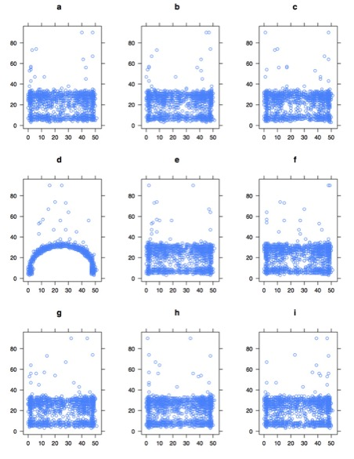

I was joking at lunch with some colleagues that I should have a few of my favorite papers linked on the main page of my website, so when I reference them for the n^th time, I can just say "look at my website" instead of promising to email them. While I don't think it's reasonable to put this on my front page, here's the current list of my "have you read [x]?" papers:

* [Evaluating the Design of the R Language](http://janvitek.org/pubs/ecoop12.pdf): I'll admit, I don't understand everything that's in this paper. And it certainly wasn't necessary to sell me on R! But, I interact with a lot of computer scientists who ask me "why R?" and this paper seems to be a much better answer than anything I manage to come up with. 
* [Technical Tools of Statistics](ftp://cm.bell-labs.com/cm/stat/tukey/memo/techtools.html): Tukey's vision of the future, from the 1960s. Interesting because we're **still** trying to figure this stuff out. 
* [Six Provocations for Big Data](http://softwarestudies.com/cultural_analytics/Six_Provocations_for_Big_Data.pdf): This article, by danah boyd and Kate Crawford, gives a great response to the buzzword trend of "Big Data."
* [Research Directions in Data Wrangling](http://vis.stanford.edu/files/2011-DataWrangling-IVJ.pdf): Just a great paper summing up some directions for research/development in the realm of data processes. 
* [Graphical Inference for InfoVis](http://jonathanstray.com/papers/wickham.pdf): Using an array of plots, most of them with "null" data, to determine if patterns you're seeing are real or just the result of randomness. 

*Permuted graphic showing the location of Lakers players when they made 3-point shots. Which do you think is the real data?*