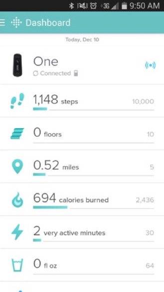
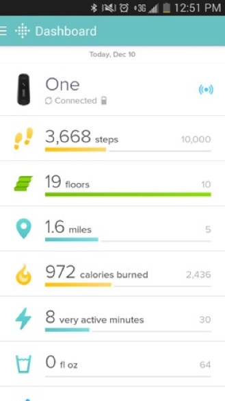
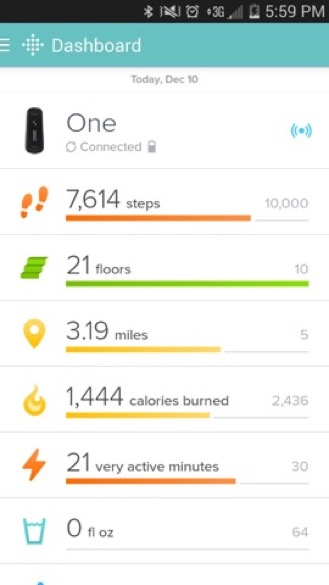
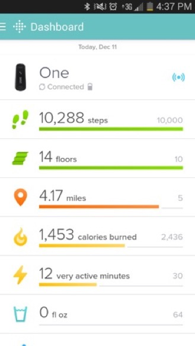

I have been a devoted Fitbit user for over a year now, and I think that as a device it is the sort of thing that a statistician would natually enjoy. It produces rich data about my day-to-day life, can be used to identify notable dates in my year, and does a great job of making me more physically active "on the margin." But, the Fitbit app designers have made very strange color choices.

I'd appreciate any insight you have about why they might have chosen these colors. Here's the daily trajectory:

When you get up and start moving, the graphs show your steps in an aqua blue that is very similar to the Fitbit dashboard color.

Then, as you continue, the colors move from aqua, to yellow, to orange/red.

Finally, when you hit your step goal the color switches to green,

This color progression drives me a little crazy. It's not in rainbow order, and it seems like it should move from red to orange, to yellow, to green/blue. In other words, the colors should indicate something about your health level.

Another choice I can imagine for the colors would be to code the progression I mentioned above to the progress you've made over the day. The Fitbit knows how long your typical day is, and it knows when you woke up. Maybe it could show green if you were making good progress to your goal for the day (given the time of day it was), yellow if you weren't, and red if you were really behind. Then, once you hit the goal it could switch to a different color (e.g. purple) to indicate you'd hit it.

Any ideas about the color trajectory they've chosen? Do other fitness trackers use similar colors?
