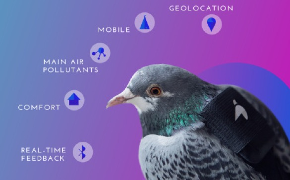
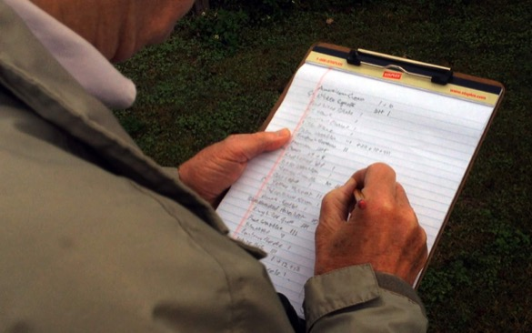

As you might know from [my blog](http://www.science.smith.edu/~amcnamara/blog/visualization/2015/01/14/FitbitColors.html) or [twitter](https://twitter.com/minebocek/status/484751171374948353), I've been a Fitbit person since December 2013. I'm also very interested in participatory sensing and citizen science, and I've been thinking about the ways that data can be used for good, both on the personal and societal level.

### Fitbit

In June 2014, I set up an [IFTTT recipe](https://ifttt.com/recipes/173925-document-your-daily-activity-in-a-google-spreadsheet) to save my step data into a google spreadsheet every day. So, I have almost two years worth of data to play with.

As you can see, I get an average of 10,000 steps a day, with quite a bit of variance. I hadn't realized this until recently, but it seems like since I moved from LA to Northampton (August 2015) I've been getting progressively fewer steps. I'm trying to turn that around, but it hasn't quite been captured by the loess line yet! I've certainly used the Fitbit data to make micro changes on the day scale, but this is my first time using longer-term data to try to make behavior changes.

After years of hearing me talk about how useful the Fitbit feedback was, my dad recently purchased one, and he loves it. Apparently he has already changed his behavior to hit 10,000 steps a day. On the phone, he instructed me to \> invent two of three more things like that

meaning simple sensor tools to help you live a better life. That's a big proposition (thanks, Dad!) but I can see some interesting developments in that space lately.

### WeMo Insight switch

 One is the [WeMo insight switch](http://www.amazon.com/gp/product/B00EOEDJ9W/ref=as_li_tl?ie=UTF8&camp=1789&creative=9325&creativeASIN=B00EOEDJ9W&linkCode=as2&tag=flowingdata-20&linkId=PXV4IU5GIASZOPRZ), which I heard about on Nathan Yau's [blog](http://flowingdata.com/2016/04/04/a-week-with-the-wemo-insight-switch/). You should go read his telling of it, but it sounds like it (or tools like it) could help people keep track of their energy use and learn to use less. That seems to count as a sensor tool to help you live a better life!

### Pigeon Air Patrol and Plume

Then, I heard about the idea of personalized pollution sensors on the [Not So Standard Deviations Podcast](https://www.patreon.com/NSSDeviations). Roger and Hilary were discussing how the [Pigeon Air Patrol](http://www.pigeonairpatrol.com/) project strapped mini air pollution sensors to trained pigeons and then let them loose in London.

Obviously, this kind of procedure could be used to produce much more data than the official governmental sensors like those maintained by the [EPA](https://www3.epa.gov/airquality/montring.html) or [DERFA](https://uk-air.defra.gov.uk/), as is the case in the UK. From what I can see, it seems like the Pigeon Air Patrol was more of a publicity stunt than anything else, and the team has moved on to having humans carry the sensors in their daily lives. They successfully [crowdfunded a campaign](http://www.crowdfunder.co.uk/crowdsource-air-pollution-in-london) to create a small sensor device that can be fastened onto a person's bag or bike to tract the air quality wherever they go.

### Using participatory sensing data

There are two main ways that I see participatory sensing or citizen science data collection projects being motivated.

-   **For the user's own edification**. This is how I see Fitbit. The company is probably using my data for their own purposes, but my reason for collecting step data is so that I can know more about myself.
-   **For the use of researchers**. In this paradigm, people who participate in the project are doing it to generate data for some type of study. They may not get any direct use out of the data themselves, but they are happy to help. This is how the pigeons (presumably) felt about collecting air quality data.

It's not clear where in this system the Plume sensor will fit. Will people be paying attention to their own personal "pollution dashboard" to see how much exposure they're getting? Or are they just data-collecting pigeons helping scientists learn more about air quality? Of course, the best projects manage to do a little of both.

### Oldschool citizen science

The Audubon Society probably deserves the award for longest-running citizen science project, for their [Christmas Bird Count](https://www.audubon.org/conservation/science/christmas-bird-count), which has been ongoing since 1900.

Volunteers go out in the month of December, observe the bird species in their area, and report back to the Audubon. In a similar vein, the Cornell Lab of Ornithology organizes [eBird](http://ebird.org/content/ebird/), a year-round, volunteer-driven data collection method to track birds.

In [this paper](http://www.sciencedirect.com/science/article/pii/S000632070900216X) (cited almost 300 times!) the authors describe their commitment to good user-rewards for eBird participants. Although the people collecting data are doing so to help the researchers, the data collection process needs to feel fulfilling to them in order to motivate them to collect and input data. The researchers observed that their data submissions went up when they instituted more user-rewards, including data visualizations on the site that allow the citizen scientists to see their data in action.

In pretty stark contrast, the EPA has a [toolbox](https://www.epa.gov/air-research/air-sensor-toolbox-citizen-scientists-resources) for citizen scientists who are interested in gathering their own air quality data. However, it's not clear if the process involves feeding the data back to the EPA for use, so it is just for the user's own edification. I'm not sure there's enough incentive there.

### Data quality

 Of course, if you are going to have many people collecting cheap data for scientific purposes, you have to worry about data quality. On the [NSSD podcast](https://www.patreon.com/NSSDeviations), that was one of the main things Roger and Hilary discussed about the Plume project.

As far as I know, this is an open problem, but I've seen some interesting work on data augmentation that looks promising. For example, [this paper](http://onlinelibrary.wiley.com/doi/10.1111/j.2041-210X.2010.00035.x/abstract) found that they could scale models created with eBird data to get very similar predictions to those produced by models trained on high quality standardized data. Another [paper](http://misrc.csom.umn.edu/workshops/2012/fall/Ipeirotis.pdf) about data produced by Mechanical Turk workers suggests the use of the EM algorithm to produce probabilistic labels that have more reliable quality. Another [awesome paper](http://www.stat.columbia.edu/~gelman/research/published/forecasting-with-nonrepresentative-polls.pdf) (by Andrew Gelman, among others) does election forecasting using non-representative polls taken on the Xbox using multilevel regression and poststratification.

All in all, I'm really excited about the possibility of more inexpensive sensor data to change the world! Certainly using tools like the Fitbit has changed my life, and I think there are things that could be done with the data (perhaps necessitating some more statistical research) that could benefit us all. As much as I love the idea of data-collecting pigeons, I want to be completely involved with the data collection process and getting something back from it myself.
