During [OpenVisConf](https://openvisconf.com), I hurriedly [posted](http://www.science.smith.edu/~amcnamara/blog/conferences/2016/04/25/OpenVisConf.html) some links from my talk so people could follow up with resources I had mentioned. I kept meaning to write up a fuller blog post, but of course life comes along (in the interim, Smith has finished finals, I've graded a ton of projects, gone out of the state twice, and attended commencement).

So, when the [official transcripts](https://openvisconf.com/#transcripts) from the conference were posted, I knew I'd struck gold. [Amanda Lundberg](https://twitter.com/Asignia) was the transcriptionist, and she did a fantastic job. The transcripts are provided with a creative commons license, so I grabbed the text from my talk, edited it a bit, and stuck in some images.

It was quite interesting to read the transcripts as-is. I know Amanda edited out a lot of "um"s and "uh"s as everyone was speaking, but a person's verbal tics still get through. In my case, I say "that", "so", and "really" a LOT. Some of those have been removed here for ease of reading.

On a more interesting note, the organizers used TF-IDF to identify unique words and bi-grams from each talk. Mine make it *pretty* clear I'm a statistician. Words like "distribution", "statistic", "observed difference" and "bootstrap" all appeared more in my talk than others.


#### Talk

Probably the easiest way to tell what the heck I'm talking about is to [watch the video of my talk](https://www.youtube.com/watch?v=hps9r7JZQP8).

<iframe width="560" height="315" src="https://www.youtube.com/embed/hps9r7JZQP8" frameborder="0" allowfullscreen>

</iframe>

But, if you're video-resistant (I usually am) this will probably give you the flavor.

#### Transcript:

The title of my talk is "Do you know Nothing when you see it?".

[](https://www.flickr.com/photos/hungry_i/66962027/in/photolist-6VctH-zr4aM-e9mH1t-6XLhY9-qo4Bms-8gyi5q-zr357-4jeF2Y-r8nhEr-3BzwrF-hWLU1-zhqjfS-6akRDL-8oHoz1-Env5V-dLro6N-6Ba6Qx-hcQm7X-45WiW8-45Wj1K-nWoLpt-8Qp68q-6a6dd5-aqc1Ri-dZmw2h-79ykph-rxzvJj-uu5px-JCCFC-9tWqkt-6EGjEv-6Juo8s-eCaru-6VMiSX-dSGL3M-6bsbPs-8cueSK-4waMSd-7zWdYW-5WrAQr-MtpXy-6gH759-MtpXJ-a7uXuC-4THFy2-69GvS-GyDeK-EntY3-a1bJ4u-8HgEn)

When I say nothing, I don't mean nothing like television static, because that's actually not nothing, that's something. It's the image, it just got garbled when it was going through the air. I mean something more like this,


but not really even this, because this is random noise that I generated with my computer. It's pseudo-random, and probably your awesome human brain is finding patterns like [DeepDream](http://deepdreamgenerator.com/) already. You can see the bunnies and hearts and clouds in my random data.

Our goal is to be able to identify when something we created is nothing. And in order to do that, I'm going try statistics.


I am a statistics professor. That means whenever I get in front of a group of people, I try to sneakily teach them some statistics.

The question is, **what is statistics about?** And it's about many things. It's about variation, which is one of the main themes we're going to talk about here. Sometimes there's modeling-- I'm going to ignore modeling almost completely. And when you take an intro stat class or if you're doing basic science, you're often asking are these two numbers different? Another way of saying is, is this one number, the difference, different than zero? Sometimes you want to know, this number, what are some other reasonable numbers we could have seen if we hadn't seen this one?

In order to answer those questions, we need context about the variation. The first example that came to mind when I was preparing this talk was ants. I don't know why. Imagine you had some ants, and you had some big-looking ants and little-looking ants.

[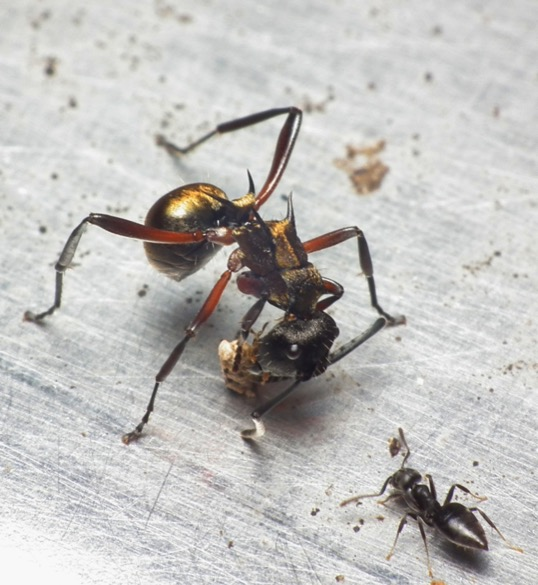](https://www.flickr.com/photos/bareego/6657872621/in/photolist-b9kkzg-325Ep2-eYdznk-9SBTFj-6tWfjj-6oC1yN-8TifHh-6iAU8p-5nWn6B-6MBDMu-BoQci-dUyXLF-9QxFLR-a51iiR-4V4xA1-558iot-g7NJrP-fktCLP-xhLeW-6sN6Mo-8v9u8H-ozavpA-4eTAda-prJXTS-4ZSm8T-9AbyuJ-YTmUb-bzKnV-4dyx2v-2ZicrS-5Tu9ez-6h1U6q-6i17hn-7iuuib-kAkPyY-n4U475-5qduaP-N4Ws3-qjGbCr-osHjb-tEsAP-3UN759-o76HA-7KjG9k-67edp-xdMVP5-6zLxaT-pgWHT-8k3imL-smJAAa/)

[](https://www.flickr.com/photos/duncan/3189039332/in/photolist-5RNEhL-rZEoXK-nYZLfC-6nmrKx-pY9yMV-eRhnD5-pSNaGV-6ofFu5-et6vZ7-oD6Ho2-a272Uq-drzFK2-a95asp-nvsEmF-6fVHz9-36MAEJ-9Y51BL-3wGr3i-2KZa9r-6wfRXP-81NL4r-8xKxZp-6nTDi1-9XUUEw-5do5mX-opjwhP-o4kqqh-aaYVKv-83tTzL-c9T3bY-6FyRKs-6sJfKz-eXfmX9-nJttup-4R4gHx-6FyRLq-bMSpZK-5rueY2-6o9yu6-a6ZWN6-bGsWE6-6K9QaB-nJtF1m-69MiSx-bq4sGw-2KZa9M-8gkRfi-nHzf5N-am8cba-4VKSnJ%22%3E%3Cimg%20src=%22%7B%7B%20site.baseurl%20%7D%7D/img/duncan.jpg)

And you thought maybe I got unlucky-- I got five big-looking ants and five little-looking ants, but really they're both draws from the same population. And overall the groups don't have any difference in size. But, you observed differences in the group sizes of three-quarters of an inch.

You and I know something about ant size variation. That sounds very large, and we'll see that it actually was.

In another context, imagine you had some a tug of war game set up, you had two teams. There's men and women split up into the blue and the pink team.


We mapped their heights, we found the average height, and we learned the average height between the groups was different. Again, we observed a difference of about three quarters of an inch.

We want to know, is that significant? Are those two teams really different, or did we just observe a difference by nature of the selection process? The random generation we're assuming is happening behind the scenes?

If you've taken a standard statistics class, you're now thinking about confidence intervals. You're thinking "point estimate, plus or minus the standard error times something that has to do with some distribution".


And maybe you're thinking about some pages in your textbook that had standard error calculations, with a bunch of square roots and fractions.


We're thinking about a difference of means. So, we think, we can just pick that first formula. But really, it's worse than that. There's all these different proofs about if you have different group sizes, and if the variances are different.

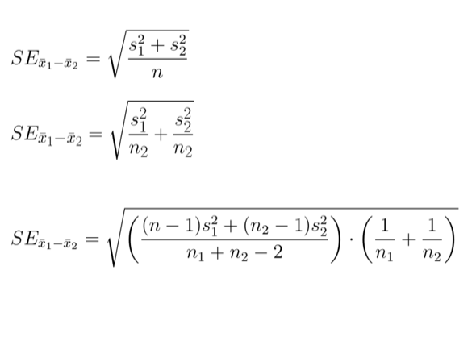

So then you need to pick that formula out. And then it is worse than **that**, because once you have the standard error calculation, you have to know the degrees of freedom you're going to look at in your distribution.

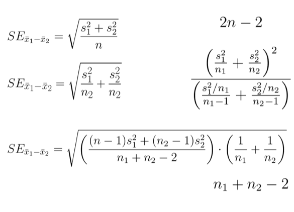

And even I-- I have a Ph.D. in statistics-- I get the heebie-jeebies if you ask me to come up with the right standard error computation. Maybe you're better at statistics than me, and came up with the right standard error, found the degrees of freedom. Now you're going to look at some idealized distribution.

[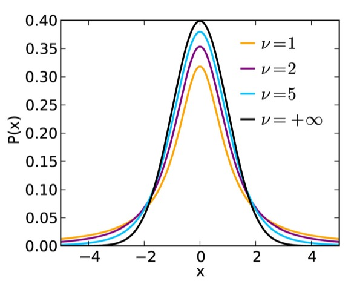](https://en.wikipedia.org/wiki/Student%27s_t-distribution)

We call this a sampling distribution. It's not a distribution of data, it's a distribution of statistics. Statistics are numbers computed from other numbers. In this case we had the average heights of the two tug of war teams and we're looking at their difference.

With your standard error and your degrees of freedom and the distribution, you could come up with some confidence interval and you could see if there was really no relationship between the team and the height, how often would we observe a difference of three-quarters of an inch?

I'm going to argue that's not the way you should do that problem. Instead, you should use randomization. And randomization is just what it sounds. You have two things you think might have a relationship. You want to come up with the sampling distribution, and you want it to be the null distribution. The distribution of, essentially, nothing.

So what you're going to do is you're going to take the values, the labels here, and you're going to mix them up. You're going to compute the group height means for those different groups in the mixed-up data and compute the difference in the heights.

So you can see already sometimes you're getting a positive difference, sometimes you're getting a negative difference. I think one of those turned out to be zero. We're going to do this like a thousand times and then we can look at the distribution of that statistic.

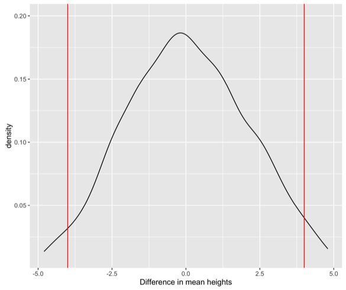

This distribution is centered around zero because it's a null distribution. And then we can calculate where is 95% of the data? What's the middle 95%? And then sort of say "if there really was no difference between the heights of these two tug of war teams, what sorts of differences might we observe?"

And so in the case of the tug of war teams, if there was really no difference, we could observe height differences that were negative four inches to positive four inches different. Our observed difference of three quarters of an inch is so tiny we think it is nothing. Even though we saw a difference of three-quarters of an inch, that was nothing.

For the ants, same thing, but the distribution looks different.


Randomization distributions are not always symmetric. And they're not always smooth. They can have these lumps. But, again, we can compute where the middle 95% of the data is. So for the ants it goes from negative 0.5 to 0.5. The observed difference of three-quarters of an inch, that would be pretty weird to see if there was no difference between my two different ant size groups.

I'm a statistician, so the open source programming language of my choice is R. If you wanted to do this yourself in R, this is the code you would use.

```         
library(mosaic)
diff(mean(~height|team, data=tugowar))

bootstrap <- do(1000) * diff(mean(~height|team, data=resample(tugowar, groups=team)))
```

So if I wanted to compute one difference in means, it's the first piece of code. And I wanted to do a thousand of them, I could use the second chunk.

But there's another technique we might want to use for assessing whether the number we got is sort of reasonable or what some other possible numbers we could have observed could be. That's bootstrapping. In bootstrapping you take the data you have, kind of like pulling yourself up by your bootstraps. Making something from nothing. That's not really possible, so we're going to make data from our old data. We're going to sample with replacement. Pull out data points. Here we're not breaking the relationship between the two variables. We're just pulling them out directly.

And you can see sometimes I get the same data point more than once in my bootstrap sample. But now I have new data, and I can treat that as my current data. And compute the mean heights, and then the possible difference in heights. And so if that observed tug of war game we saw was really representative of the world, other than 0.75 I might have observed 0.6637.

I can come up with a bootstrap distribution, much in the same way I can with randomization.


The bootstrap distributuon might not be symmetric. It is centered around the estimate from the real data. In this case, centered around the 0.75. And then it shows us some possible numbers we could have observed.

So, again, if that was our data and we were generating bootstrap samples, we might have seen differences from negative 3 to positive 4, and again we think ours is not different from nothing or zero.

And with the ants, all the observed values we could have seen, they are all negative.


So, we think there is a relationship. One of those groups is bigger than the other.

If you want to know more about randomization and the bootstrap, you could look at this [open source textbook](www.openintro.org). What? It was written by some really cool statisticians. [The source](https://github.com/OpenIntroOrg) is all on GitHub. You can download the PDF for free. If you like physical books, you can buy this statistics textbook that I used in my class for [\$9 on Amazon](http://smile.amazon.com/Introductory-Statistics-Randomization-Simulation-David/dp/1500576697?sa-no-redirect=1). So it's really cool and good.

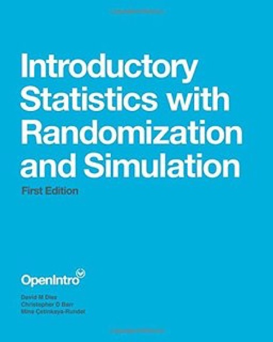

If you want other resources, Jonathan Stray has a five minute lighting talk from NICAR, ["Solve Every Statistics Problem with One Weird Trick"](http://bit.ly/OneWeirdStatsTrick), and that one weird trick is randomization, so you kind of know about that.

\[\](http://jonathanstray.com/me

And Tim Hesterberg, has a paper, ["What Teachers should know about the Bootstrap"](http://bit.ly/KnowAboutBootstrap). I think it really should be called what everyone should know about the bootstrap.

[](http://www.timhesterberg.net/home/bio)

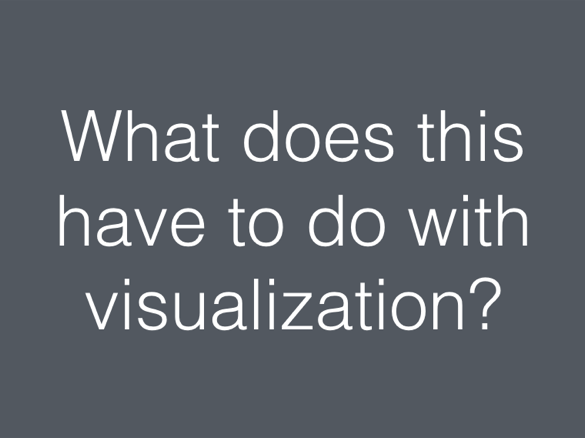

So what does this all have to do with visualization? We're going to try to do the same thing with visualization as we did with numbers. Try to say is this different than nothing? What are other things we could have observed? And this is going to help us try to not make visualizations that don't show anything.

When I say that, I don't mean visualizations of the type you see on [WTF-viz](http://viz.wtf/),

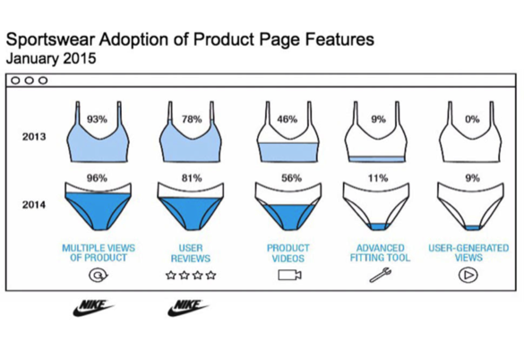

although I like making fun of those too. And I don't mean showing nothing in the way Darrell Huff is talking about in the 1950s with How to Lie with Statistics.

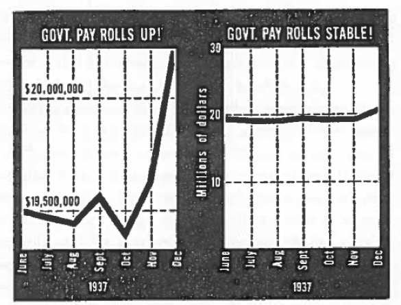

Instead, I'm talking about using techniques like randomization. There's an awesome paper by [Hadley Wickham](http://hadley.nz/), [Andreas Buja](http://www-stat.wharton.upenn.edu/~buja/), [Di Cook](http://dicook.github.io/) and [Heike Hofmann](http://hofmann.public.iastate.edu/).

::: columns
::: {.column width="20%"}
[](http://hadley.nz/)
:::

::: {.column width="20%"}
[](http://www-stat.wharton.upenn.edu/~buja/)
:::

::: {.column width="20%"}
[](http://dicook.github.io/)
:::

::: {.column width="20%"}
[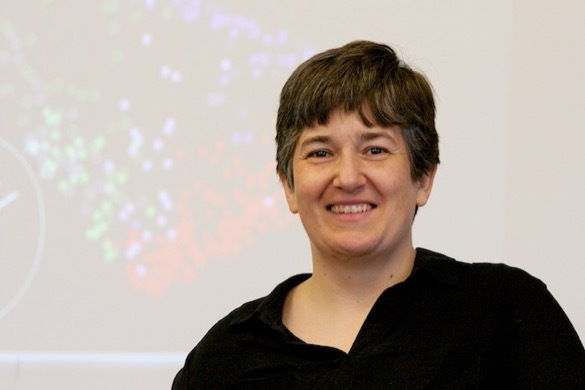](http://hofmann.public.iastate.edu/)
:::
:::

It's called [Graphical Inference for InfoVis](http://bit.ly/graphical_inference). I think it's really worth checking out. One of the techniques they suggest in the paper is called the lineup.

[](https://www.flickr.com/photos/mike_crane/5188333652/in/photolist-8UtyQu-syKEK-9SHXTx-2azAWL-bCqhR4-7rSB2w-syKgn-bCqiAv-bCqhHt-bCqhWH-9WLjQh-bpvnxY-jHWcxM-bpvniA-Bh14D-bpvnCL-9VekKT-9Vh1Jo-9Vh4TS-765vEj-9Vh9Qd-bmKeHQ-ALLCXL-9Vhc17-9Veatv-oW5cC4-9VebyX-9Vef9H-9VgZFS-9Vh1wy-9VhbtN-9VekZi-9Vh2eJ-9Vh6es-9Vh1jA-9VhaeJ-9Vh8U9-9Vhaqo-9VhbLQ-9Vekxi-9Vec4p-9Vh7RL-9Vh16W-72qhos-9Vh6P5-9VgZeL-9VenuT-9Vea3D-9VeeSa-72mhJi)

The idea of the lineup is you put your data, your plot that you think shows something real, in a lineup with a bunch of innocent plots. If you can pick your accused plot out of the lineup of innocent plots, that means that it's somehow different than nothing.

To illustrate this, I would break the relationship between X and Y and look at what other plots I could have gotten from the same data with that relationship broken.

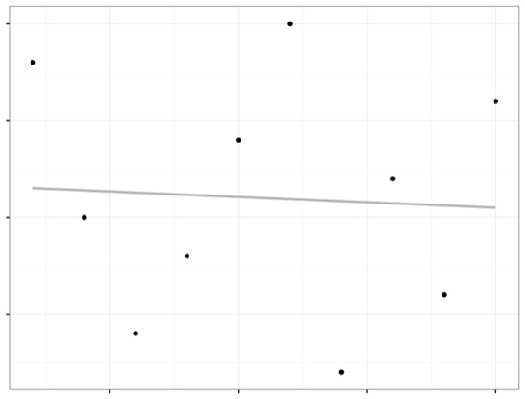

Instead of looking at them all in sequence, I want to look at them all together. Let's take an example. This is some data about loans. And I'm plotting the balance of a loan against the income. And I'm coloring by whether or not a person defaulted on their loan.


And my human brain sees a pattern. I say, it looks like people who default on loans are the ones that have really high loan balances. It doesn't matter if they're rich or poor, it's just those high loan balances.

Is it possible I just sort of made that up? This is what it would look like if you use the protocol in the graphical inference paper and look at the plots.


There's 20 plots, because we often use a standard p-value cutoff of 0.05, which is the same as one out of 20. If you guessed randomly, you'd get the right one 1 out of 20 times even guessing at random.

So with this one I think you can probably identify which is the real plot. Part of it is I showed you the real one before. You might have recognized it.

In practice you shouldn't look at the accused plot alone before you look at it in the lineup. So either you should build this into your workflow, looking at a lineup of plots every time you make a visualization, or more realistically, if you make a plot and think it might sort of show nothing, make a lineup and show it to someone who hasn't seen the original plot.

```         
library(ggplot2)
ggplot(Default)+
  geom_point(aes(x=balance, y=income, col=default))

library(nullabor)
ggplot(lineup(null_permute('default'), Default))+
geom_point(aes(x=balance, y=income, col=default)) +
 facet_wrap(~.sample)

decrypt("OlCE bQTQ Aw GWPATAWw d")
```

If you're an R person, this is familiar. This is the ggplot code to make a scatterplot. And the bottom is to randomize the data to make null plots. I'm doing a null permute on the label of default versus not default and wrapping those facets into an array of plots. When you run the code, they have done a clever thing, it will make a plot in your plotting window, but also prints this text in the console.

It says decrypt and then it's a bunch of nonsense characters. And that's where they hid the answer. So if you were doing this on your computer and you wanted to not know ahead of time which was the real plot, but figure it out afterward, this is how to do it. You take the piece of code, and run the code, tells you where the true data was. So in this case we got it right.

```         
decrypt("OlCE bQTQ Aw GWPATAWw d")
[1] "True data in position 14"
```

You can use the same code for the t-test. This is the tug of war teams again. Somewhere in there I've hidden the real plot of the different heights. The crosses represent the mean heights for each of the groups. The question is if you can pick out the real data. So in your head, make your guess.


It says decrypt, if you're good at decrypting quickly, you could see what it is. But the true data is in position 5.

```         
decrypt("OlCE bQTQ Aw GWPATAWw J")
[1] "True data in position 5"
```

That's not the one I picked out. Certainly not the most extreme of the possible plots. What this is telling me is the same thing as the permutation test I did with the statistics and the distribution at the beginning of the talk. There really isn't a difference between these two groups.

So I've given you a positive example and a negative one. But this one, I don't think you really needed visualization to tell you that answer. You could have used standard statistics. The power of the graphical inference technique, is it's generalizable. You can use it for anything.

One thing where I think humans are great at finding patterns in noise is in time series analysis. This is about the steps I take. So it's from my FitBit. And sometimes I like to make up stories, like the variance is going up. Or the mean seems like it's changing. Or something happened in December. I'm really good at making up those stories about the distributions.


So again, the real data is in there. Again, look at it and try to see if you can guess which one it is. And now we're going to try and decrypt. So there's the string again.

```         
decrypt("OlCE bQTQ Aw GWPATAWw y")
[1] "True data in position 4"
```

It says the true data is in position 4. Again, that wasn't the one I had picked out. But if I had just shown you the one time series plot, you would have believed my stories about what was interesting about that plot.

With the statistics analog, we've been doing the "is this different than zero?" task. Now I want to switch to the "what are some other reasonable values we could have gotten for this?" task. So with the numbers, that was what are some other reasonable values we could have gotten.

And then I'm going to talk about that in terms of plots. So some of this comes from joint work with a colleague of mine, [Aran Lunzer](http://www.vpri.org/html/team_bios/aran_lunzer.htm), we worked together at the Communications Design Group. This is the highest quality image of Aran I could find.

[](http://www.vpri.org/html/team_bios/aran_lunzer.htm)

I guess it's almost life size in the theater, so maybe that's fine.

We worked on a tool, a prototype tool, and we called it [LivelyR](http://vimeo.com/93535802). This is real in the sense that if you go on GitHub and [download the code](https://github.com/aranlunzer/shiny) you could run it yourself. I don't recommend it. It's very buggy. But it really has [R](https://cran.r-project.org/) on the back end and [LivelyWeb](http://lively-web.org) and javascript on the front end.

::: video
<iframe src="//player.vimeo.com/video/93535802" width="500" height="281" frameborder="0" webkitallowfullscreen mozallowfullscreen allowfullscreen>

</iframe>
:::

<p><a href="http://vimeo.com/93535802">LivelyR introductory demo</a> from <a href="http://vimeo.com/user27554411">Aran Lunzer</a> on <a href="https://vimeo.com">Vimeo</a>.</p>

It lets you play with the bin width and bin offset of a histogram. Many things let you do this, but this also lets you overlay a sweep of parameter values. So you can see a variety of histograms with the same bin width and slightly different bin offsets. And they form what I like to call a histogram cloud. Which is like a kernel density estimate, but easier for people to understand.

There's one more feature we built into this, which is you can call out the individual histograms if you want to. Instead of seeing them overlaid as a cloud, you could do small multiples. And it's actually a two-hand interaction here. There's an iPad and you're controlling the one screen with your right hand and the other with your left hand. So it's a little bit buggy. But you can see the small multiples of the different possibilities of histograms you could have seen.

Again, I think it's really easy with histograms to use the default algorithm, the [Sturges algorithm](https://en.wikipedia.org/wiki/Histogram) or whatever it is in your favorite tool, which will make the bin widths for you. If you're using [ggplot2](http://ggplot2.org/), it will give you a warning, like, I chose a default but you should come up with something better. But, many people don't. I know that you all do, because you're visualization professionals.

But it's not always obvious to non-professionals that those defaults make a huge difference. You might use the defaults and find what looks like a pattern, but it's really just the result of the parameter values you chose. So giving people the opportunity to play with the parameters is really powerful.

After Aran and I did this work in one dimension, looking at the histograms. I started thinking how could we do this in two dimensions? Which got me thinking about maps.

The [Modifiable Aerial Unit Problem](http://bit.ly/maup16) says that if you aggregate spatial data in different polygonal shapes, you're going to get different spatial patterns.


This can happen with [gerrymandering](http://bit.ly/exp_gerrymander).


It can happen with different county and zip code data, these different levels of polygons. And there are a lot of statistical problems that go along with that.

Aran Lunzer and I worked together on [this next tool](http://bit.ly/spatial_agg), which doesn't really have a name.


It takes point data about earthquakes in southern California and aggregates them into polygons. But instead of making fixed polygons, you can scale and rotate and move the polygons to see some other possible values of the visualization you could have gotten. So you start with your default values and maybe you think there are very obvious trends everyone should be aware of. You can tell some great story about why there is a hot spot of earthquakes in this one place.

But then when you start manipulating the polygons, you can see there are many other possible patterns you could have created.

[](https://www.flickr.com/photos/sjrohde/4687848929)

What I want you to take away from this talk is that there are statistical tasks and very analogous visualization tasks. In statistics we want to know if two numbers are different, which is like knowing if one number is different than zero. We could use tools like randomization to answer that question. In the visualization world we can use randomization in a different way to answer the question, is this plot different than nothing?

In statistics we might want to ask, what are some reasonable, other possible values for this number? What other differences in heights could we have observed? And you can use something like the bootstrap to show you other possible reasonable values. In the visualization space, using parameter manipulation, or giving users the ability to see how your parameter choices impact the visual story they are seeing can be really powerful.
