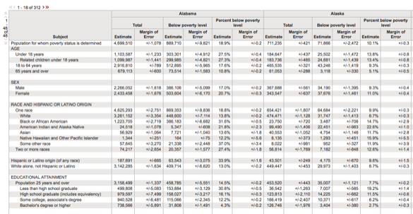
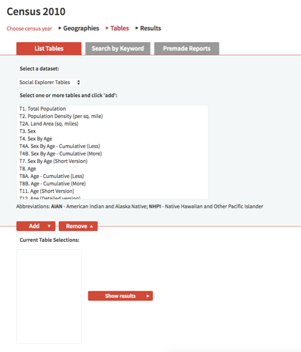

As usual toward the end of the semester, my students begin working in earnest on their final projects. And as usual, this results in my selective amnesia about [census.gov](http://www.census.gov) being ruptured yet again. Looking for a way out, I turned to [twitter](https://twitter.com/AmeliaMN/status/798620977202663424) and got some good recommendations. In case it's useful to other teachers/people, I'll share my thoughts.

(The tl;dr is that you probably want students to be using [Social Explorer](http://www.socialexplorer.com/), but read on for the full rant.)

First, some motivation. A group of students in my class has found some interesting data at the state level, which they think may be related to demographic characteristics of states, like population, poverty level, education, racial makeup, etc. This is where my amnesia kicks in. "It should be really easy to find data like that!" I say. "Let's go to the [American FactFinder website](http://factfinder.census.gov/) and I'll show you how it works." We bumble around on the site for a while, clicking on "Data Main" (a page of screenshots and news) "Data tools and apps" (actually has the link to what we want, but buried among other unrelated things), etc. Finally I manage to find FactFinder main page. We select our geography (states) and dismiss the box that is trying to get us to add yet another geography. We search for "poverty" and voila! ...the ugliest dataset you have ever seen.

[](https://factfinder.census.gov/faces/tableservices/jsf/pages/productview.xhtml?pid=ACS_14_5YR_S1701&prodType=table)

I always encourage students to work with data programmatically, but even I have to admit that it would be easier to delete columns and add better names in a spreadsheet. The column names are in multiple *rows* for crying out loud! Plus, what you would like to be observations (states) are actually variables. I am now imagining the `gather`/`spread` in my future. I want students to understand data cleaning and wrangling, but I don't want their first experience to be hellish. Even my heart is sinking, thinking about doing this all myself.

## APIs

Okay, so what are the alternatives? The Census does offer an API, so I signed up for an API key and started playing with some R packages recommended by folks on twitter. The most commonly-mentioned package was `acs` (a CRAN package), although I also heard about `acs14lite` and `censusapi` (both on GitHub and installable using `devtools`). Sadly, none of these packages have vignettes. I've been using R for almost 10 years, so yes, I could figure it out from the documentation, but it would take time (which I am short on) and isn't something I can ask the students I have in this class to do.

[Thomas Lumley](http://www.statschat.org.nz/) pointed me to this blog post on [working with ACS data in R](http://dlab.berkeley.edu/blog/season-sharing-data-working-newly-released-census-2010-2014-acs-5-year-data-r) which was much more readable. I'm not thinking about maps for this particular application, but I can read around that part. I was able to reproduce the code in the post (yeah!) and modify the first retrieval command to get data for states:

```         
stateDemo <- acs14(geography='state', variable = c('B17021_001E'))
```

But, this isn't the only variable I'm interested in! So, how do I learn what other variables I want? As far as I can tell, I have to go to the [Census API site](http://api.census.gov/) and read [this table](http://api.census.gov/data/2015/acs1/variables.html). Say I'm interested in race. I can search the page for that word, but I get almost 5,000 results.


And even if I locate a variable I am interested in, the descriptions are pretty hard to parse.


The result of this is that it would be all too easy to think you were getting one thing and actually request another. Plus, when you generate your list of variable strings like `B02001_009E`, you also need to maintain a corresponding list of human-readable names like `TwoOrMoreCount`. If I were writing a peer-reviewed research paper, I would be grateful for the huge amount of detailed breakdowns and the API access, but for a semester-long student project in a class focused on modeling, it's too much.

## Using my network

When I asked on Slack, several folks sent me files they had created using the APIs (thanks, [Mara](https://twitter.com/dataandme) and Adam!), but of course they didn't have all the variables I really wanted. And, while I'm grateful to my supportive social media network, I know not everyone has that!

## User interfaces

I had been expecting to be able to find a bunch of GitHub repos full of cleaned up data like the stuff Mara and Adam sent to me on Slack. It seems like people don't really do that, or if they do it's not documented in such a way that it is findable. But, [Ryan](https://twitter.com/ryan_boyer2) pointed me to the [Social Explorer](http://www.socialexplorer.com/), an online tool mostly designed for making pretty maps online, that includes a Tables functionality that is almost exactly what I was looking for!



It allows you to select your geography, then you can search by keyword or scroll through a manageable list of variable names and add them to a custom table. You can preview the data (it looks like states will be the variables, but never fear, this changes in the download), then choose the format you want to export it in. Other than a slight loss of reproducibility, the only drawback in my mind is that the variable names are still unintelligible, so you have to also download a data dictionary, but it *makes you a custom dictionary* based on the variables you chose so you don't have to wade through the entire thing!

It looks like the Tables functionality is mostly for "premium" users, which is too bad, but Smith (like many other academic institutions) has a site license.

Are there other resources out there I have missed? Why is this such a hard problem? I'd love to hear from you.
