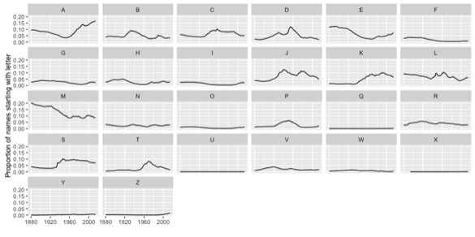

I get called Amanda a lot. This tends to drive me crazy, because I think
my real name is much more interesting. But, I realized recently that
given the prior probabilities, it's actually a very reasonable thing to
call me.

[Note: this blog post has some interactive elements, so it is probably more fun to read on [my shiny server](https://ameliamn.shinyapps.io/Amanda/). And of course, if you want to see what I did, the [code is on GitHub](https://github.com/AmeliaMN/shiny-server/blob/master/Amanda/Amanda.Rmd).]

To investigate this using data, I am using the `babynames` R package,
which has data from the Social Security Administration. It includes all
names that had at least 5 uses for a particular gender in a given year.
Obviously, that leaves some people out, but actually this data includes
most (documented) people in the United States. For more about this, see
my data appendix.

The basic idea is to take my (approximate) age and see how likely it is
that my name is Amanda. I look incredibly young, but given that I have a
PhD and am a statistics professor, there's a lower bound on how young I
could really be. Lets assume that people talking to me believe I was
born between **1980-1989**, inclusive. So the question is, given that I
was born then, **what are the chances my name is Amanda?**

In a blog post at the beginning of last semester,
[Mine Cetinkaya-Rundel](http://www2.stat.duke.edu/~mc301/)
[linked](http://citizen-statistician.org/2016/08/13/a-timely-first-day-of-class-example-for-fall-2016-trump-tweets/)
to a 538 article from 2014 that approaches the problem from the other
side-- [How to tell someone's age when all you know is her
name](http://fivethirtyeight.com/features/how-to-tell-someones-age-when-all-you-know-is-her-name/).
Interestingly, although using this method would help confirm people's
suspicions that I'm a child (the *Age|Name* method would
estimate I'm [about 13 years
old](http://rhiever.github.io/name-age-calculator/index.html?Gender=F&Name=Amelia)),
that's not how people tend to think about names and ages.

Instead, people seem to be taking an approximate age and then just
grabbing a name out of the hat. In other words, they are using the
*Name|Age* method. With that in mind, let's see how likely
Amanda really is. I'm focusing just on girls names for this analysis,
mostly because Amelia isn't a common boy's name (see my data appendix).

In the eighties, numbers for Amanda and Amelia were as follows:

<table>
<thead>
<tr class="header">
<th align="left">name</th>
<th align="right">number</th>
<th align="right">proportion</th>
</tr>
</thead>
<tbody>
<tr class="odd">
<td align="left">Amanda</td>
<td align="right">369690</td>
<td align="right">0.0215329</td>
</tr>
<tr class="even">
<td align="left">Amelia</td>
<td align="right">9734</td>
<td align="right">0.0005670</td>
</tr>
</tbody>
</table>

Armed only with the information that I was born between 1985 and 1989,
there's a **2% chance my name is Amanda**. That's actually pretty
incredible! (In contrast, there's just a 0.05% chance my name is
Amelia.) And, we can figure most people remember at least the first
letter of a name. So, what if we add the fact that my name starts with
an A?

In the eighties, numbers for Amanda and Amelia (out of all A names) were
as follows:

<table>
<thead>
<tr class="header">
<th align="left">name</th>
<th align="right">proportion</th>
</tr>
</thead>
<tbody>
<tr class="odd">
<td align="left">Amanda</td>
<td align="right">0.1575295</td>
</tr>
<tr class="even">
<td align="left">Amelia</td>
<td align="right">0.0041478</td>
</tr>
</tbody>
</table>

Now, there's a **15.7% chance my name is Amanda** (and a 0.4% chance my
name is Amelia). The only A name that was more popular than Amanda in
the eighties was Ashley, which made up 19.5% of the female names
starting with A. Of course, Ashley doesn't have as similar of a sound to
Amelia as Amanda does. I didn't go this far, but we could also look at
the names starting with Am-- I think this would serve to solidify Amanda
as the much more likely choice.

So, for those of you that have felt bad about getting my name wrong in
the past-- the data supports you!

I'm not sure if doing this analysis has made me feel better about being
called Amanda-- for that, I just tell myself **"they're probably mixing
me up with [Amanda
Cox](http://www.nytco.com/amanda-cox-named-editor-the-upshot/)."**

Your name
---------

Does this trend hold up with the name people are always calling you? Are
you a Jacob that always gets called Jason? A Kirstin that gets called
Kristen? (I'm guilty of that one.)

[This is the part of the post that is responsive, so you probably want to head to [my shiny server](https://ameliamn.shinyapps.io/Amanda/).]

Data appendix
-------------

I can get off-track when doing analyses, so here are a couple more
thoughts.

### How full is the data?

One thing I was worried about was how well the data really represented
the population. Uncommon names are excluded for privacy purposes, and I
thought maybe people were getting more (or less) creative with names
over time. It turns out that may be the case, but only slightly.

<table>
<thead>
<tr class="header">
<th align="right">Min.</th>
<th align="right">1st Qu.</th>
<th align="right">Median</th>
<th align="right">Mean</th>
<th align="right">3rd Qu.</th>
<th align="right">Max.</th>
</tr>
</thead>
<tbody>
<tr class="odd">
<td align="right">2.462</td>
<td align="right">3.535</td>
<td align="right">5.592</td>
<td align="right">5.406</td>
<td align="right">6.793</td>
<td align="right">9.374</td>
</tr>
</tbody>
</table>

On average, only 5% of people are missing from the data. That feels
pretty good to me. The article mentioned above, 538 estimated that only
1% of the data was missing, which I'm not sure how they estimated.

### How many baby boys are named Amelia?

Answer-- not many. In 2004, the year with the most male Amelias, 14 baby
boys were named Amelia. Or, someone checked the wrong box on a birth
certificate.

<table>
<thead>
<tr class="header">
<th align="right">year</th>
<th align="left">sex</th>
<th align="left">name</th>
<th align="right">n</th>
</tr>
</thead>
<tbody>
<tr class="odd">
<td align="right">2004</td>
<td align="left">M</td>
<td align="left">Amelia</td>
<td align="right">14</td>
</tr>
</tbody>
</table>

### Creativity in naming

Of course, there's a lot deeper I could dig on this analysis. Just by
scrolling through the data I noticed there are many other ways to spell
Amanda, which didn't get taken into account. (Maybe the creative
spellings of Amelia balance it out.)

<table>
<thead>
<tr class="header">
<th align="left">name</th>
<th align="right">number</th>
<th align="right">proportion</th>
</tr>
</thead>
<tbody>
<tr class="odd">
<td align="left">Aamanda</td>
<td align="right">10</td>
<td align="right">0.0000006</td>
</tr>
<tr class="even">
<td align="left">Amamda</td>
<td align="right">178</td>
<td align="right">0.0000104</td>
</tr>
<tr class="odd">
<td align="left">Amanda</td>
<td align="right">369690</td>
<td align="right">0.0215329</td>
</tr>
<tr class="even">
<td align="left">Amandah</td>
<td align="right">16</td>
<td align="right">0.0000009</td>
</tr>
<tr class="odd">
<td align="left">Amannda</td>
<td align="right">23</td>
<td align="right">0.0000013</td>
</tr>
</tbody>
</table>

### A is for eighties

You can actually see the eighties pretty clearly when you look at plots
of letters names start with. Girls' names starting with A had been on
the rise since the 1960s, but you see a local maximum in about 1984 and
then a small decline before continuing to rise.

