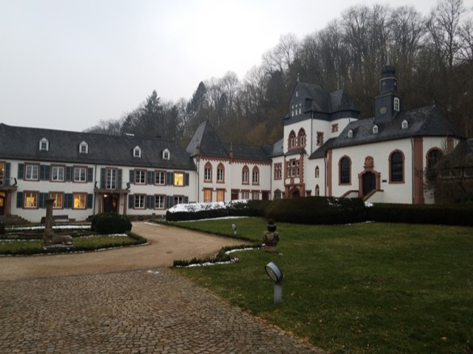

Over the last 10 days, I had the pleasure of attending [rstudio::conf](https://www.rstudio.com/conference/) and the Dagstuhl seminar on [Evidence about Programmers for Programming Language Design](http://www.dagstuhl.de/en/program/calendar/semhp/?semnr=18061). At rstudio::conf, I taught a two-day workshop on [Intro to R & RStudio](https://github.com/AmeliaMN/IntroToR), and at the Dagstuhl I mostly thought about exposing novices to programming in scientific contexts. So, there was a lot of overlap. 

[Schloss Dagstuhl](http://www.dagstuhl.de/) is a historic castle that hosts workshops on topics related to computer science. The idea is to bring a small group of people (ours was about 35) together for a week to discuss a specific topic, with the goal of advancing the discipline. 

In this case, what we wanted to advance was evidence about programmers for programming language design. Most programming languages are designed by intuition. But, given that the people who write programming languages are not always the people who use them, and we may be quite different from most users, this is likely not the best strategy. To improve, we'd like to put the "science" in "computer science."

We began the week with presentations from a subset of the attendees (I wrote a separate post about my talk, [Scientists Programming](www.science.smith.edu/~amcnamara/blog/conferences/2018/02/11/Scientists-Programming.html)). The talks were aimed to ground us in the disparate disciplines we came from, including programming language design, eye tracking, science, and education. Then, we spent the remainder of the time in discussion, both small-group and full-group. 

I was invited to the workshop by [Andreas Stefik](http://web.cs.unlv.edu/stefika/), the absolute master of Skype networking with other academics. Stefik is known for developing an evidence-based programming language, called [Quorum](https://quorumlanguage.com/). He was the only person I had interacted with at all before the conference, and our interactions had been limited to Skype and email. 

However, I discovered many connections with other folks once I was there. 

### Brad Meyers - better language goals

One of the first presentations of the workshop was by Brad Myers, who [spoke about](http://materials.dagstuhl.de/files/18/18061/18061.BradA.Myers1.Slides1.pdf) types of studies. However, what stuck out the most to me was his modified version of programming language goals.  

<blockquote class="twitter-tweet" data-lang="en">
Brad Myers started his <a href="https://twitter.com/hashtag/dagstuhl?src=hash&amp;ref_src=twsrc%5Etfw">#dagstuhl</a> talk by comparing programming language design goals:  (traditional) 1. Correctness 2. Performance (of code) 3. Expressiveness 4. Speed of compiling   (usability) 5. Understandability  6. Ease of reading 7. Modifiability 8. Learnability
&mdash; Amelia McNamara (@AmeliaMN) <a href="https://twitter.com/AmeliaMN/status/960502906821767168?ref_src=twsrc%5Etfw">February 5, 2018</a></blockquote>

These goals reminded me of my [key attributes for a modern statistical programming tool](https://arxiv.org/abs/1610.00985) paper. 

### Neil Brown - data on student errors

Neil Brown, who worked on Greenfoot and BlueJ (IDEs for novices learning Java) was there. He and I talked about a principle I have absorbed from Greenfoot, that novices should never be presented with a blank screen, but instead some scaffolding. 

Brown has data on many students' Java code from Blackbox, a way to capture data from students using BlueJ. 
<blockquote class="twitter-tweet" data-lang="en">
Next up, Neil Brown of <a href="https://twitter.com/KingsCollegeLon?ref_src=twsrc%5Etfw">@KingsCollegeLon</a> on analyzing programming data. BlueJay is an IDE for Java beginners, Blackbox can capture data about it. They have data on 300 million compilations, which is  ~3TB (compressed) of source code.
&mdash; Amelia McNamara (@AmeliaMN) <a href="https://twitter.com/AmeliaMN/status/961530821596401664?ref_src=twsrc%5Etfw">February 8, 2018</a></blockquote>

Teachers think they are good at predicting errors, but they actually are not. 

<blockquote class="twitter-tweet" data-lang="en">
Teachers are pretty certain they can predict what errors students will make. But, is that actually true?
&mdash; Amelia McNamara (@AmeliaMN) <a href="https://twitter.com/AmeliaMN/status/961533231077175296?ref_src=twsrc%5Etfw">February 8, 2018</a></blockquote>

This and many other great insights are in [Brown's slides](http://materials.dagstuhl.de/files/18/18061/18061.NeilC.C.Brown1.Slides.pdf). 

### Brett Becker - better errors

Speaking of errors, Brett Becker [talked about](http://materials.dagstuhl.de/files/18/18061/18061.BrettA.Becker2.Slides.pdf) improving compiler errors. 

<blockquote class="twitter-tweet" data-lang="en">
Becker: Error messages are accusatory and negative. Do we need to say “terminated” and “illegal”? “I’m going to get killed, and I’m going to jail.”
&mdash; Amelia McNamara (@AmeliaMN) <a href="https://twitter.com/AmeliaMN/status/961546402986897410?ref_src=twsrc%5Etfw">February 8, 2018</a></blockquote>

### Felienne - what *is* programming?

I was delighted to meet [Felienne](http://felienne.com/) in person after hearing Jenny Bryan [talk about her](https://github.com/jennybc/2016-06_spreadsheets), and following her on [twitter](https://twitter.com/felienne) for years. Felienne gave my favorite [talk](http://materials.dagstuhl.de/files/18/18061/18061.FelienneHermans1.Slides.key) of the workshop, which ranged from her work on spreadsheets as programming to her more recent work teaching students about "code smells" in Scratch. 

Felienne asked "What is programming anyway?"

<blockquote class="twitter-tweet" data-lang="en">
What is programming anyway? <a href="https://twitter.com/Felienne?ref_src=twsrc%5Etfw">@Felienne</a> talking about 🧠head vs. ❤️. <a href="https://t.co/9qCfMq80KW">pic.twitter.com/9qCfMq80KW</a>
&mdash; Amelia McNamara (@AmeliaMN) <a href="https://twitter.com/AmeliaMN/status/961151780657729537?ref_src=twsrc%5Etfw">February 7, 2018</a></blockquote>

She pointed out that while "every programmer ever" says that "Everyone should learn programming," the community can be quite restrictive about what it considers to be "real programming." Funnily enough, while everyone seemed to understand what she was saying, I also got pushback about [my talk](www.science.smith.edu/~amcnamara/blog/conferences/2018/02/11/Scientists-Programming.html). 

Often, we put users in one category and programmers in the other. But, there are many people who are "swimming in the water" of programming, and don't even know they're doing it. People who work deeply with spreadsheets are programmers, but they wouldn't describe themselves that way. Again, this had reverberations with the [scientists programming](www.science.smith.edu/~amcnamara/blog/conferences/2018/02/11/Scientists-Programming.html) stuff I talked about. 

<blockquote class="twitter-tweet" data-lang="en">
After spreadsheets, <a href="https://twitter.com/Felienne?ref_src=twsrc%5Etfw">@Felienne</a> started working on “code smells” in <a href="https://twitter.com/scratch?ref_src=twsrc%5Etfw">@scratch</a>. <a href="https://t.co/Ci9hGnesSh">pic.twitter.com/Ci9hGnesSh</a>
&mdash; Amelia McNamara (@AmeliaMN) <a href="https://twitter.com/AmeliaMN/status/961153216971931648?ref_src=twsrc%5Etfw">February 7, 2018</a></blockquote>

Felienne asked us two questions:

<blockquote class="twitter-tweet" data-lang="en">
Two dimensions: what is programming for? What is programming like? <a href="https://twitter.com/Felienne?ref_src=twsrc%5Etfw">@Felienne</a> making a case for creativity and self-expression. <a href="https://t.co/GzzSRg5Rc0">pic.twitter.com/GzzSRg5Rc0</a>
&mdash; Amelia McNamara (@AmeliaMN) <a href="https://twitter.com/AmeliaMN/status/961156021279444992?ref_src=twsrc%5Etfw">February 7, 2018</a></blockquote>

One answer to "what is programming like?" is writing. 

<blockquote class="twitter-tweet" data-lang="en">
One metaphor <a href="https://twitter.com/Felienne?ref_src=twsrc%5Etfw">@Felienne</a> likes is programming as writing. There are many things that “count” as writing. Can be for yourself, can be for others, can be creative. <a href="https://t.co/eMlZhaJQ2D">pic.twitter.com/eMlZhaJQ2D</a>
&mdash; Amelia McNamara (@AmeliaMN) <a href="https://twitter.com/AmeliaMN/status/961159455948886016?ref_src=twsrc%5Etfw">February 7, 2018</a></blockquote>

I've used it a lot, so I think programming as writing is a pretty robust metaphor. 

### Baker Franke - teachability and learnability

Another person I was delighted to meet was [Baker Franke](https://twitter.com/bakerfranke) of [code.org](https://code.org/), who it turns out worked on the [Exploring Computer Science](http://exploringcs.org/) (ECS) project before I joined it as a graduate student. At some point, I used the phrase "data the students can see themselves in" and he mentioned he'd written something about that in the early ECS curriculum. I'm now certain that's where this idea (which I have fully integrated into my worldview) came from. It's always fun to pin down those influences.

Franke's talk was also great, and teased out the subtle differences between learnability and teachability of a language. 

<blockquote class="twitter-tweet" data-lang="en">
We’ve been expanding our definition of language properties at <a href="https://twitter.com/hashtag/dagstuhl?src=hash&amp;ref_src=twsrc%5Etfw">#dagstuhl</a>. <a href="https://twitter.com/bakerfranke?ref_src=twsrc%5Etfw">@bakerfranke</a> adding “teachability,” although he says this might not be a problem for language designers but a problem of pedagogy. <a href="https://t.co/b1HlrgUJyH">pic.twitter.com/b1HlrgUJyH</a>
&mdash; Amelia McNamara (@AmeliaMN) <a href="https://twitter.com/AmeliaMN/status/961185848539713538?ref_src=twsrc%5Etfw">February 7, 2018</a></blockquote>

He echoed my feeling that consistency in teaching is so important (the reason why I teach only one R syntax in my intro classes)

<blockquote class="twitter-tweet" data-lang="en">
For learners, consistency is good. Flexibility may not be helpful. <a href="https://twitter.com/bakerfranke?ref_src=twsrc%5Etfw">@bakerfranke</a> <a href="https://t.co/g8NokrqC15">pic.twitter.com/g8NokrqC15</a>
&mdash; Amelia McNamara (@AmeliaMN) <a href="https://twitter.com/AmeliaMN/status/961187475308863490?ref_src=twsrc%5Etfw">February 7, 2018</a></blockquote>

He also has an idea about scaffolding in language design, 

<blockquote class="twitter-tweet" data-lang="en">
Mitch Resnik wanted <a href="https://twitter.com/scratch?ref_src=twsrc%5Etfw">@scratch</a> to have a low floor, high ceiling, wise walls. <a href="https://twitter.com/bakerfranke?ref_src=twsrc%5Etfw">@bakerfranke</a> wants a low floor, high ceiling, narrow walls to start, and wider walls as you get closer to the ceiling.
&mdash; Amelia McNamara (@AmeliaMN) <a href="https://twitter.com/AmeliaMN/status/961192913714675713?ref_src=twsrc%5Etfw">February 7, 2018</a></blockquote>

This was just a selection of the talks that related most directly to my interests. If you want to see the rest of them, they are posted on the [seminar materials page](http://materials.dagstuhl.de/index.php?semnr=18061), and for more context on the people who attended (not all of whom presented), you can read [everyone's introductory slide](http://materials.dagstuhl.de/files/18/18061/18061.SWM.Slides.pdf), and check out the [twitter list](https://twitter.com/AmeliaMN/lists/evidenceaboutprogrammers) I made of all the participants who are on twitter.  

### More than talks

But, of course the point of the Dagstuhl was not just talks. It was making connections with other researchers. At every meal, we were assigned random seats to help us meet more people. We had structured time to think about programming language design studies we would like to see (thanks, Baker!) and time to discuss in groups. At the end of the last day, we developed a massive spreadsheet of current projects, future projects, and resources. I can see at least five potential projects I might lead or become involved with. The types of things I think about in terms of teaching statistics and R seemed to fit right in with the questions others at the workshop were asking-- a novel feeling! 

I know I'm not the only one who feels this way. Several other folks have already written up their thoughts on the seminar, including [Andy Ko](https://medium.com/bits-and-behavior/designing-learnable-teachable-and-productive-programming-languages-dagstuhl-trip-report-81e41bde84bd), [Brett Becker](https://cszero.wordpress.com/2018/02/11/dagstuhl-seminar-18061-evidence-about-programmers-for-programming-language-design/), and of course [Felienne's liveblogging](http://www.felienne.com/archives/tag/dagstuhl). 
Johannes Hofmeister captured his ideas on video, 

<blockquote class="twitter-tweet" data-partner="tweetdeck">
Me, trying to capture all my ideas from the Dagstuhl seminar. Not a time lapse, actual speed of thoughts :D <a href="https://t.co/kDolr7e8gb">pic.twitter.com/kDolr7e8gb</a>
&mdash; Johannes Hofmeister (@pro_cessor) <a href="https://twitter.com/pro_cessor/status/962765672110592000?ref_src=twsrc%5Etfw">February 11, 2018</a></blockquote>

I can't wait to see where things go from here. 

