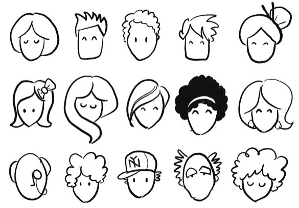

One incidental piece of the Dagstuhl is I thought more about the use of the term "guys." While we were going around and doing our initial 3-minute introductions, I heard a lot of uses of "guys" that rubbed me the wrong way, so when I introduced myself I asked people to think about their gendered word choices throughout the seminar.

I regret doing this, because I think it marked me as someone who cares mainly about gender issues (I was there for the PL design stuff!) and I don't think anyone really understood my point. People did become more aware of when they were saying it (and we used "squirrels!" as an interjection when someone did it), but not in a way that fostered inclusiveness. I'll try to outline my personal opinion on the term here.

Like [the results](https://jvns.ca/blog/2013/12/27/guys-guys-guys/) from the survey I linked in my [previous post](http://www.science.smith.edu/~amcnamara/blog/conferences/2017/12/19/On-Microaggressions.html), I find it gender-neutral when people use the second person phrasing of "you guys." This means it's okay to address a mixed-gender group by saying "hey guys, what's up?" "okay guys, let's focus" "it's time for us to go to lunch, guys," etc. (That being said, I would encourage you to work toward saying something more inclusive, like "folks", "peeps", "ya'll", "everyone", etc.)

The problem comes when you talk about people in the third person. In [the survey](https://jvns.ca/blog/2013/12/27/guys-guys-guys/), phrases like "we're going to need to hire a Python guy" or "I met a great Erlang guy" were perceived by the majority *not* to be gender-neutral. This is the useage that people were abusing in the Dagstuhl. I often heard people say, "I was talking to the google guys," "I know the guys who worked on that," "the guys who study these things," etc. If the speaker realized they had used the word guys, they would justify by saying "and they're actually all men," as if that made it okay. That is actually *worse*.

As a rule of thumb, I told someone at the Dagstuhl "if you can see the people in front of you, saying "guys" is okay. If you can't see them, don't use it." This is perhaps an oversimplication, but it gets at that second-person ("you guys") versus third-person ("those guys") distinction.

We know that women are underrepresented in STEM, and perhaps particularly in computer science (the Dagstuhl seminar I attended was about 20% female, which [seems to be the norm](https://twitter.com/AmeliaMN/status/961900236477169664)). Ed Yong outlines some of the issues in the beginning of his [piece on increasing the diversity of scientists he quotes](https://www.theatlantic.com/science/archive/2018/02/i-spent-two-years-trying-to-fix-the-gender-imbalance-in-my-stories/552404/). To quote Ed,

> Women in science face a [gauntlet of well-documented systemic biases](https://hbr.org/2015/03/the-5-biases-pushing-women-out-of-stem). They face long-standing stereotypes about [their intelligence](https://www.theatlantic.com/science/archive/2017/01/six-year-old-girls-already-have-gendered-beliefs-about-intelligence/514340/) and [scientific acumen](http://www.nature.com/scitable/content/does-gender-matter-by-ben-a-barres-10602856). [They need better college grades](https://www.theatlantic.com/science/archive/2016/02/male-biology-students-underestimate-their-female-peers/462924/) to get the same prestige as equally skilled men, they [receive less mentoring](http://www.pnas.org/content/109/41/16474.full), they’re rated as [less competent and less employable](http://www.pnas.org/content/109/41/16474.full) than equally qualified men, they’re less likely to be invited to [give talks](https://www.theatlantic.com/science/archive/2017/12/women-are-invited-to-give-fewer-talks-than-men-at-top-us-universities/548657/), they earn [less than their male peers](http://www.nature.com/news/inequality-quantified-mind-the-gender-gap-1.12550), and they have to deal with significant levels of [harassment and abuse](https://blogs.scientificamerican.com/context-and-variation/safe13-field-site-chilly-climate-and-abuse/).

When you say "the guys at google," you are erasing the women who work there, even if the people *you happen to know* are all male.

I know lots of cool men, but when I talk about teams to my students (who are mostly female, because I work at a women's college) I try to speak in gender neutral terms. If my students have heard me talk about "the people I know at google," "the people I know at facebook," "the people who work on the tidyverse," etc., they can project themselves into that group. When they come to me for a contact at a company, and I put them in touch with a man, that feels incidental. I know lots of people, that contact just happened to be male. Plus, in between when I make those statements in class and when people follow up, teams often diversify and I meet more folks. So by starting with a gender-neutral, I'm leaving the door open for more diverse teams in the future.

I don't want to hear about gender, I want to hear about the work. If you are going to reference a specific person, of course it is okay to indicate their gender and use their pronouns. But, if you're going to speak about a group of two or more people in the third person, please try to remove the word "guys" from your vocabulary. We're all people.

\[Image via [prestosketching](http://prestosketching.com/blog/2018/01/27/easy-ways-to-show-more-diversity-in-your-sketches/)\]
