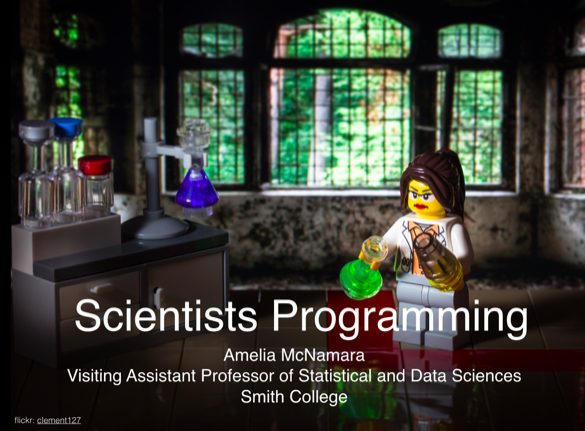

At the Dagstuhl seminar, [Andreas Stefik](http://web.cs.unlv.edu/stefika/) asked me to speak about "Scientists Programming." I'm not sure whether he did this on purpose, but by assigning people their talk titles, he drew us a little outside our comfort zone and got us to think more deeply. "Scientists Programming" wasn't a talk that I had in my pocket, and wasn't what I would have proposed, but it was fun to pull together. It made me realize that scientists programming is actually one of my primary interests, although I've never written that anywhere before. Felienne wrote up a [nice summary](http://www.felienne.com/archives/5900) of my talk, but I wanted to write down some thoughts of my own. 

[](https://www.flickr.com/photos/clement127/15236140202/in/photolist-pdncEs-rabMJr-qSKYvp-qPeSji-rmJJdW-btryhH-qK7VJj-cm1Hb-qdaYpW-fWAdZ-9WhgHt-oLa2TT-2vuJD-2vuKd-mk1ib-qAU7wq-r3voVM-8CAcWc-9oggZ-7w3hnt-56tdL-oLa3fV-2vuPq-2vuJ5-oLqNAT-otW1FH-hGxPy-9Gbfpi-kyh6Q-wL7Y9q-anxVft-otW5n1-bWGa2P-qmxh8-otWG7V-nCpBGK-oLa2C2-pqcggk-61RzgT-dgrA8g-gbGJp-nBBqqg-anxVyP-6KVaRB-anAxnS-anxJWP-oJoZ4d-rcEdVP-aySHmX-anxJdr)

In the talk, I broke scientists' programming tasks three categories:

- making models to generate data
- generating data to make models
- application programming.

That first category would include any scientist who has a theory about the world, and using modeling to try to represent some relationship, then runs the model to generate data. Once you have that data, you compare it to what you've seen in the real world to see how good your model is. I've seen this done in ecology with predator/prey relationships, but I'm pretty sure physicists, chemists, and many others use this same technique. 

The second category is the one I think about the most, because it's more statistical. In this paradigm, scientists generate data (through experimentation, surveying, observation, etc), and use those data to generate a model, which is likely statistical. Then, they assess how well the model does at representing the real world. I see these first two paradigms as two sides of the same coin. 

The final category, application programming, is the one I know the least about. I know some scientists do things like program a Raspberry Pi to do some specific sensor activity, or program a robot to explore in a deep cave. However, I think that this category is usually in service of one of the above two (scientists are usually trying to observe something about the world). Since application programming is outside of my expertise, and I knew it would be the most familiar to the group at the Dagstuhl, I didn't discuss this in my talk. 

You can [see my slides](http://materials.dagstuhl.de/files/18/18061/18061.AmeliaA.McNamara1.Slides2.pdf) if you want to know everything I covered, but the meat of the talk was digging into the paper by Julia Stewart Lowndes, et al, ["Our path to better science in less time using open data science tools"](https://www.nature.com/articles/s41559-017-0160). This paper is a perfect case study of a group of scientists who "We thought [they] were doing reproducible science" by using Excel, writing up their process, keeping versions of files by changing filenames, etc. But, they were able to transition to a more robust workflow using git/GitHub, R/RStudio, and RMarkdown. This has made them more accurate, and reduced the amount of time they spend on analysis. 

To me, this is crucial. Science is the source of a lot of the "ground truth" we rely on as a society. It determines which treatments get used by doctors, what interventions we try on the environment, and just our general knowledge of how the world works. If science is wrong, there are big implications. One common example are [Excel errors in genomics research](https://genomebiology.biomedcentral.com/articles/10.1186/s13059-016-1044-7). 

I love that Lowndes' group has made their code [available on GitHub](https://github.com/OHI-Science/). This is useful on so many levels

- Anyone wanting to check their calculations can do so
- If you are a scientist, you can use it as a reference for coding
- Programming language designers can examine how scientists authentically code. 

In my talk, I showed some arbitrarily-chosen code from their repo to display how the tidyverse syntax makes code more human-readable. 


```
monitoring_indicator_mean_loc= monitoring_indicator_mean %>% 
        left_join(., select(coastal_fish_loc, station_cleaned, lat, lon), 
                                    by=c("monitoring_area" = "station_cleaned"))

coastal_fish_loc = coastal_fish_loc %>%
                    mutate(lat = DECWGSN,
                           lon = DECWGSE) %>%
                    mutate(lat = ifelse(station_cleaned== "ICES SD 31", 64.207281,
                                 ifelse(station_cleaned== "ICES SD 30", 61.679815,
                                 ifelse(station_cleaned== "ICES SD 29", 59.705518,
                                 ifelse(station_cleaned== "ICES SD 32", 60.108130,
                                 ifelse(station_cleaned== "Rectangle 23 & 28", 63.505817,
                                 		lat))))),
                           lon = ifelse(station_cleaned== "ICES SD 31", 23.511161,
                                 ifelse(station_cleaned== "ICES SD 30", 21.269112,
                                 ifelse(station_cleaned== "ICES SD 29", 21.264879,
                                 ifelse(station_cleaned== "ICES SD 32", 25.772410,
                                 ifelse(station_cleaned== "Rectangle 23 & 28", 21.351243, 
                                 		lon)))))) %>%
                    mutate(station_cleaned = as.character(station_cleaned),
                           station = as.character(station))
```

```
temp_long = coastal_fish_scores %>% 
            select(monitoring_area,core_indicator,taxa, score1,score2,score3) %>%
            group_by(monitoring_area, core_indicator,taxa) %>%
            gather(score_type,score,score1,score2,score3) %>%
            ungroup()

slope2 = slope2 %>%
        group_by(basin_name, core_indicator) %>%
        mutate(slope_mean_basin_indicator = mean(slope_mean_basin_taxa))%>%
        ungroup()

basin_n_obs = coastal_fish_scores_long %>% 
                            filter(score_type=="score1") %>% 
                            select(Basin_HOLAS) %>%
                            count(Basin_HOLAS)
```

Interestingly, the programming language designers found this code hard to read and confusing. Although I've heard computer scientists complain about R many times before, I wasn't anticipating this. I thought that the piped sequence of function calls would be pretty readable. Maybe it was the `%>%` for the pipe rather than `|`, or maybe they would have preferred to see it as separate steps. 

I wish I had shown this example, taken from Garrett Grolemund's Master the Tidyverse materials (which I also showed in my [Intro to R & RStudio](https://github.com/AmeliaMN/IntroToR) workshop).

```
arrange(select(filter(babynames, year == 2015, 
  sex == "M"), name, n), desc(n))
```

```
boys_2015 <- filter(babynames, year == 2015, sex == "M")
boys_2015 <- select(boys_2015, name, n)
boys_2015 <- arrange(boys_2015, desc(n))
boys_2015
```

```
babynames %>%
  filter(year == 2015, sex == "M") %>%
  select(name, n) %>%
  arrange(desc(n))
```

I think with this comparison, it's easier to see why the piped approach is better for people. With the nested function calls, you have to do a lot of checking in your head to make sure the parentheses are matched, and it's hard to follow the logic. The incremental approach is good, but you type the name of the data many times. In the last example, the data flows through the piped sequence in a clearer way. 

One question that came up in my talk was "if we fixed the problems with R as a language, would you appreciate that?" and I didn't have a great answer. As a user, I (and I believe most scientists) don't feel the language issues that frustrate computer scientists. It just works for what I need to do. In fact, my talk introduced yet another idea that we came back to again and again-- some people who use programming languages don't think of themselves as programmers. I know many people who use R, but consider it a tool to do data analysis rather than something to program in. 

I think the thing I exposed people to that they were most excited about was RMarkdown. While it seemed most people were familiar with the idea of iPython/Jupyter notebooks, they hadn't seen knitr before. The idea that they could create a fully reproducible journal article interweaving text and code was very appealling. I showed a simple example with HTML output including text, code, and code output, but over the next few days I demoed more complex (Rnw) examples from my own work that produce publication-ready documents. For example, [this pdf of a paper for Computational Statistics](https://github.com/COSTDataExpo2013/AmeliaMN/blob/master/PaperFinalDraft.pdf) was generated from [this LaTeX/knitr file](https://github.com/COSTDataExpo2013/AmeliaMN/blob/master/PaperFinalDraft.Rnw). While this group of computer scientists work on experiments surrounding programming language design, and therefore do the same types of data analytic tasks as many scientists, they didn't have this piece of their workflow. 

