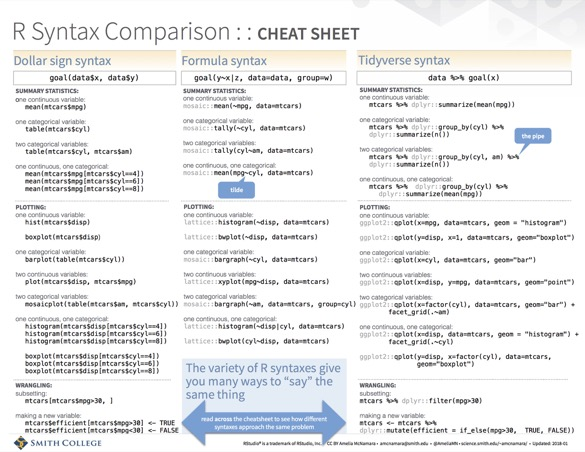

For my rstudio::conf working, Intro to R & RStudio, I finally finished my [cheatsheet on R syntaxes](https://github.com/rstudio/cheatsheets/raw/master/syntax.pdf). I've been working on this for at least a year (😱 ), so I'm glad to see it out in the wild.

When I posted the cheatsheet online, I got some critical feedback, which I would like to address in the form of a FAQ.

[](https://github.com/rstudio/cheatsheets/raw/master/syntax.pdf)

**Q: Why didn't you include data.table syntax?**

**A:** Mostly, because I don't know `data.table`, so I wouldn't have done a good job. Also, because I don't know of anyone who is teaching data.table to absolute novices. However, if someone wanted to generate all the analogous tasks (summary statistics, plots, wrangling) in data.table and share them, I would be very interested.

**Q: Why did you use the word "syntax" when that's not quite precise?**

**A:** Because that is a word commonly associated with programming languages. While these three paradigms may not be precisely three different syntaxes, they are certainly [syntactic sugar](https://en.wikipedia.org/wiki/Syntactic_sugar) or idioms within the language. I often refer to them as like accents within a human language. If you were learning English, you wouldn't try to learn it with a British accent, an accent from the American South, and an accent from Australia. You'd learn it one way, and be able to recognize other accents.

**Q: Why didn't you express \[x\] in this more efficient way?**

**A:** This usually comes up because of my use of

```         
mean(mtcars$mpg[mtcars$cyl==4])
mean(mtcars$mpg[mtcars$cyl==6])
mean(mtcars$mpg[mtcars$cyl==8])
```

instead of

```         
tapply(mtcars$mpg, mtcars$cyl, mean)
```

and

```         
mtcars <- mtcars %>%
    mutate(efficient = if_else(mpg>30,  TRUE, FALSE))
```

instead of

```         
mtcars <- mtcars %>%
    mutate(efficient = if_else(mpg>30))
```

In both of these cases, I was erring on the side of

-   

    a)  more verbosity

-   

    b)  a more general pattern

Personally, although I learned R long before the tidyverse existed, I never got adept at the `apply()` family of functions. Every time I needed to use one, it was a fall down a rabbithole of "tapply? sapply? mapply?" (In fact, trying to create that tapply call for this post included just such a search.) While I would encourage people coding within the base R paradigm to learn these functions, I think the three-line version is easier to think through, and represents a much more common "style" that you will see on places like StackOverflow. In many cases, there is no `apply` equivalent, and you end up doing this sort of repetitive writing of the dataset name and nesting of statements.

With the `mutate()` call, even though it was unnecessary to include the TRUE and FALSE, I knew that it would provide a better pattern for students who wanted to make their own variables. If you want `efficient` to instead be "yes" and "no" character strings, you can just sub "yes" for TRUE and "no" for FALSE, without having to think about the magic that goes with logicals.

**Q: Why didn't you show ggformula or the formula-based base R plots?**

**A:** I did! They're just on the back of the sheet. I don't feel like [ggformula](https://cran.r-project.org/web/packages/ggformula/index.html) is a full-fledged graphics library yet, so I don't want to present it as such. `base` graphics, `lattice` graphics and `ggplot2` graphics are all full libraries, so I used those on the front of the sheet. As for formula-based base R plots, I think they are much less common online. My main use case for this cheatsheet is to give to students who I am teaching one particular syntax. For example, I used to teach completely in the formula syntax, but have switched to tidyverse syntax. However, sometimes when I demo code I switch to another syntax because it feels more natural for the task. Or, students google something and find code from another syntax. The cheatsheet serves as a grounding device to say, this is just another way to express the same idea I am familiar with. Since I (almost) never teach base R, I include it on the cheatsheet mostly as a foil to my argument that the tidyverse is more human-readable.

Do you have other questions? Ask me in the comments!
