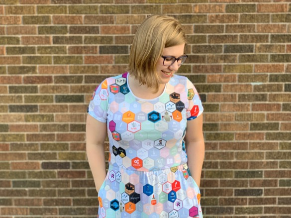
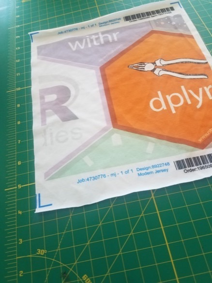
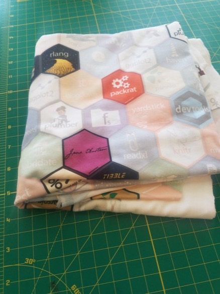
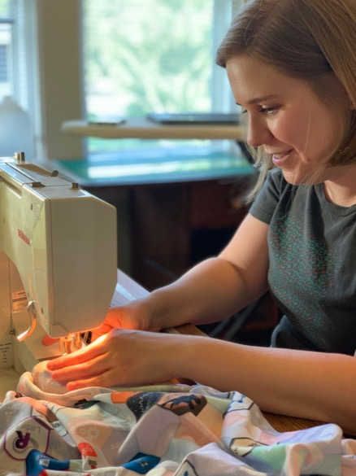

That's right ya'll, I made myself a R hex logo dress! 

I've been thinking about this dress for at least a year, if not longer. But I finally had a summer where I wasn't moving, and I decided to make it happen. 

The first step was looking for a good nested hex image. I searched the internet, and came across [a way to use magick](https://blog.mitchelloharawild.com/blog/hexwall/) to nest hexes. I love R and reproducible work, so I played around with this code for a while to see if it would do what I wanted. Pretty quickly, I ran into problems with non-standard hex sizes, as well as errors I struggled to debug. So, I turned away from code. 😭

You may or may not know that I started college at art/design school. While I realized design wasn't for me, I have a year of color theory, art history, 3D design, digital design, etc., under my belt. This means I can kinda-sorta use Adobe Illustrator. I'm maintaining a version of CS6 on my computer to avoid paying for Creative Suite (sorry if that means my files are deprecated!). 

I gathered the RStudio hexes from [their GitHub repo](https://github.com/rstudio/hex-stickers/), and  searched the internet to find a few additional hexes. My final design uses hex logos from blogdown, bookdown, broom, devtools, dplyr, feather, forcats, fs, ggplot2, glue, googlesheets, haven, hms, janeaustenr, knitr, lobstr, lubridate, magrittr, packrat, parsnip, plumber, readr, readxl, reprex, rladies, rlang, rmarkdown, roxygen2, rstudio, scales, shiny, skimr, stringr, testthat, tibble, tidyverse, usethis, visdat, withr, xaringan, and yardstick. Mostly, I picked packages that I personally use. 

The most time-consuming part of this entire process was laying out the hexes. As I learned, not all hexes are exactly the same size. Some aren't quite hexagons. And, when you're going to make fabric, you need the right edge of the design to match up perfectly with the left edge, and the top with the bottom. There was lots of zooming in, fiddling with dimensions, and nudging objects by a pixel one direction or another.

Luckily for me, I was in the midst of this nudging while I was at the Columbia, MD [StatPREP workshop](https://ecstatic-mclean-a0b3e0.netlify.com/blog/schedule-howard/). I ran my idea past [Danny Kaplan](https://www.macalester.edu/~kaplan/). He looked at my design and immediately could see it was too busy. I was nesting all these extremely colorful, highly saturated images right next to each other, and it was overwhelming. His initial suggestion was to leave blank spaces in between the hexes, but I really wanted tiles. So then he suggested making many of the hexes less opaque, with just a few at full opacity. This turned out to be genius, because the lighter areas were easier to match together when sewing, and hid some of the issues with the edge matching. 

Initially, I tried using R to generate random 0s and 1s to tell me which to make full opacity. This ended up looking terrible (true randomness doesn't look random to humans!), so I ended up hand-choosing the opaque hexes. My goal was to emulate the way hexes often look on laptop lids (here's [my laptop](https://devlids.com/lids/ameliamn) on [devlids](https://devlids.com/)). 

<blockquote class="twitter-tweet">
Laptop stickers spotted in the wild at the Southern MN Stat Chat! <a href="https://t.co/3RipGl3tI7">https://t.co/3RipGl3tI7</a> <a href="https://t.co/KJVYGr6Vi7">pic.twitter.com/KJVYGr6Vi7</a>
&mdash; Amelia McNamara (@AmeliaMN) <a href="https://twitter.com/AmeliaMN/status/1121915555177480192?ref_src=twsrc%5Etfw">April 26, 2019</a></blockquote> 

Once I had the Illustrator file, I exported to JPG. I've written about [making fabric posters on Spoonflower](https://www.amelia.mn/blog/conferences/2014/12/12/FabricPosters.html), so I knew about their upload process. You need to upload a TIF, JPG, PNG, or GIF. Can't say why I chose JPG on this particular occasion. The important thing is to make sure your DPI (dots per inch) is high enough to look good. Spoonflower recommends 150 DPI, but I think I used 300 DPI. More on this later. The Illustrator file and exported JPG are both on my [hexfabric GitHub page](https://github.com/ameliamn/hexfabric). If you want to adjust the design, include different hexes, etc., feel free to use and modify those files!

Although I am mostly a procrastinator, I actually took my time on this project. So, once I had uploaded the design I got a "test swatch" printed from Spoonflower. I'm so glad I did, because I didn't realize how big the hexes initially were! I think this was a result of the DPI, perhaps if I had used the recommended 150 DPI the hexes would have come out how I expected. No problem, I used the "smaller" button on Spoonflower and got the design the way I wanted. 

In another shocking bout of preparation, I decided to make a test dress out of a plain fabric before jumping in with the custom fabric. I chose not to use a pattern, but instead pattern off existing garments. I learned how to pattern from existing garments at a sewing makerspace in Northampton, MA while I lived there. Sadly, [the makerspace](https://www.beehivesewing.com/) is now defunct, but the owner does have a neat [etsy shop](https://www.etsy.com/shop/BeehiveSewingStudios)! (Fun fact-- I got a too-big conference tshirt from [OpenVisConf](http://www.openvisconf.com/2017/) a few years ago, and I used the material from that shirt to re-make a shirt that fit as my class project, patterning off a Shiny tshirt.) If you're a loyal reader of this blog, you may remember that I get [too attached to particular items of clothing](https://www.amelia.mn/blog/misc/2014/06/12/Sweater_Variation.html), so patterning off existing garments lets me give old things new life. I modified my tshirt pattern from the makerspace class for the bodice, and patterned the skirt off an Old Navy dress I loved but had worn out.

Of course, the challenge with drafting your own pattern is that you don't get a nice set of instructions! Luckily, I had my t-shirt instruction booklet from the makerspace class, and a salesperson at my [local fabric shop](http://www.treadleyardgoods.com/) had told me about [a pattern](https://www.colettepatterns.com/catalog/moneta) that sounded similar to what I was sewing, and suggested looking for a [sew-along tutorial](https://youtu.be/gshREJvdCCM?t=438) to explain how to do the clear elastic gathering for the skirt. 

I had two yards of grey jersey material, so I cut out all the pieces out of that to verify that two yards was a reasonable amount of fabric. For plain material, I think I could have gotten the dress cut from one yard of material, but I knew that with a patterned material I'd need more wiggle room. Satisfied that two yards was enough, I threw caution to the wind and purchased two yards of my new design from Spoonflower. 

In the interim, I sewed up the grey practice dress. When working with stretchy material (like jersey), it's best to use a Serger rather than a regular sewing machine. Sergers do "interlock" stitching, which holds together better on stretchy material. Luckily for me, my mom has a Serger, and she was willing to let me use it. Over a couple sewing sessions at her house, the dress came together. I was really glad I chose to do the practice dress, because I made all sorts of mistakes and discovered issues in my pattern. And, most importantly, while I was sewing at her house my mom mentioned POCKETS! My original Old Navy dress didn't have pockets, so I hadn't patterned them. But of course the internet [knows how to make pockets](http://seaminglysmitten.blogspot.com/2014/10/tutorial-how-to-sew-knit-dress-with.html). Those got added in as I went. With the grey dress done, I was ready when my custom fabric arrived. 

Of course, you want to wash and dry fabric before you work with it, to avoid issues with shrinkage. I washed and dried my fabric and was on to the second-hardest part of the project: cutting out the pieces for the final dress. I wanted everything to be straight, upright, and ideally match up along seams. So hard! The other tricky thing was the neckband, which I knew would look busy if I cut it out of the patterned fabric. I thought of trying to buy some plain white jersey for the neckband, but the store I looked at didn't have anything that matched the fabric weight. But, when my Spoonflower order arrived, I realized there was a little white edge outside the print area that I could use! Very fortuitous. 

The sewing went much quicker on the tidyverse dress than the grey one, because I had worked out all the kinks ahead of time. I did my best to match up the pattern wherever possible, but because of the gathering in the skirt and the curved seams on the shoulders, it didn't often happen. However, those low-opacity hexes proved to be very forgiving for overlap. 

Although I had access to a Serger for doing most of the work, I needed a different machine to finish the hems. Apart from the community and the classes, the thing I miss most about the sewing makerspace I used to go to is the coverhem machine. If you look at the hem of almost any commercially-made garment you have (especially if it's knit), it probably was done on a coverhem. The back looks like Serger stitches, all interlocked, and the front has two rows of parallel stitches that look like they were done on a regular machine. As far as I can tell, there's nowhere in Minneapolis to use a coverhem machine, so I had to learn to do knit hems on a regular sewing machine. I've been following [crazyauntpurl](https://www.instagram.com/crazyauntpurl/) since she had a blogspot blog, and she sews with knits on her standard machine, so I knew it was possible. Again, my [local fabric shop](http://www.treadleyardgoods.com/) employee helped me find a good [twin needle](https://www.amazon.com/Schmetz-Stretch-Twin-Needles-Size/dp/B002F01F7U?sa-no-redirect=1&pldnSite=1) I could use on my machine, and reminded me to make sure my needle position was centered and my machine was *not* on zig-zag. The hems turned out pretty well, although they "tunneled" a little, so if I was going to do this again I would find some [interfacing to stabilize the seams](https://www.mariadenmark.com/2014/08/twin-needle-hem/). 

My [best friend](https://twitter.com/AmeliaMN/status/1162030771466645506) came over for the very end of the sewing process to do some documentation. 

Once the dress was finished, I put it on and she did an awesome photoshoot of me in front of all the photogenic walls in my neighborhood!

The dress made its debut at the [2019 noRth conference](https://rnorthconference.github.io/), where it was a definite hit. I'm excited to see how much it sticks out in group photos!

Of course, people on twitter immediately wanted their own version. If you've read this far into my post, I hope you can understand why I'm not getting into the custom-dressmaking business! I am definitely an amateur when it comes to sewing. As I said on Twitter,

<blockquote class="twitter-tweet">
If you want to edit the design, I’ve put the files on GitHub, <a href="https://t.co/47FC2uMMCn">https://t.co/47FC2uMMCn</a> <a href="https://twitter.com/hashtag/rstats?src=hash&amp;ref_src=twsrc%5Etfw">#rstats</a> <a href="https://twitter.com/hashtag/tidyverse?src=hash&amp;ref_src=twsrc%5Etfw">#tidyverse</a>
&mdash; Amelia McNamara (@AmeliaMN) <a href="https://twitter.com/AmeliaMN/status/1162359528178036737?ref_src=twsrc%5Etfw">August 16, 2019</a></blockquote> 

Of course, not everyone has the skills to sew their own projects! So, I started looking into some of the online retailers suggested by folks on Twitter. I haven't seen any of these products yet, so I can't really vouch for their quality, but if you want to make the leap here are a couple places you can buy things:

- [Table cloth](https://www.spoonflower.com/en/home-decor/dining/rectangular-table-cloth/8922748-r-hex-fabric-small-hexes-by-ameliamn), [cocktail napkins](https://roostery.com/p/frizzle-cloth-cocktail-napkins/8922748-r-hex-fabric-small-hexes-by-ameliamn), [tea towels](https://roostery.com/p/orpington-linen-tea-towels/8922748-r-hex-fabric-small-hexes-by-ameliamn), [duvet cover](https://www.spoonflower.com/en/home-decor/bedding/duvet-cover/8922748-r-hex-fabric-small-hexes-by-ameliamn), [throw pillow](https://roostery.com/p/catalan-square-throw-pillow/8922748-r-hex-fabric-small-hexes-by-ameliamn), and [more housewares](https://www.spoonflower.com/en/products/8922748-r-hex-fabric-small-hexes-by-ameliamn) (scroll down) available on Spoonflower via Roostery
- A bigger hex version is coming to Spoonflower soon! I think that version looks better on the duvet cover and other large housewares. 
- [A-line dress](https://www.redbubble.com/people/ameliamn/works/40622264-r-hex-fabric-small-hexes?asc=u&p=a-line-dress), [miniskirt](https://www.redbubble.com/people/ameliamn/works/40622264-r-hex-fabric-small-hexes?p=pencil-skirt&ref=available_products), [laptop sleeve](https://www.redbubble.com/people/ameliamn/works/40622264-r-hex-fabric-small-hexes?p=laptop-sleeve&ref=available_products), and [many more items](https://www.redbubble.com/people/ameliamn/works/40622264-r-hex-fabric-small-hexes) (scroll down and click "Also available on") on Redbubble. 
- Similar products on Redbubble using [large hexes](https://www.redbubble.com/people/ameliamn/works/40622162-r-hex-design-large-hexes), including a [shower curtain](https://www.redbubble.com/people/ameliamn/works/40622162-r-hex-design-large-hexes), [throw blanket](https://www.redbubble.com/people/ameliamn/works/40622162-r-hex-design-large-hexes?p=blanket&ref=available_products), and [tote bag](https://www.redbubble.com/people/ameliamn/works/40622162-r-hex-design-large-hexes?p=tote-bag&ref=similar_products). Again, scroll down and click "Also available on" to see all options
- [Regular mousepad](https://www.zazzle.com/r_hex_mouse_pad-144405333200562879), [gel mousepad](https://www.zazzle.com/r_hex_gel_mouse_pad-159993639402971234), [baby burp cloth](https://www.zazzle.com/r_hex_baby_burp_cloth-256223453753317443), [bandana](https://www.zazzle.com/r_hex_bandana-256345773298354764), [and more](https://www.zazzle.com/store/ameliamn/products) on Zazzle. 
- Of course, the things most people want are really hard to find quality vendors for. I've heard requests for tshirts (working on it!), dresses with pockets (this may be impossible), leggings (working on it! Although this may be a weird design for leggings...), and pants (this seems impossible, too). 
- As above, if *you* find a site where you can upload a design, feel free to use the files [from GitHub](https://github.com/ameliamn/hexfabric) to make your own products! 

I'm so excited to finally have this physical artifact I've been dreaming about, and I would love to see ya'll get the same kind of joy! 

 

