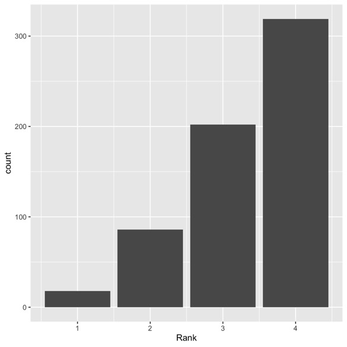
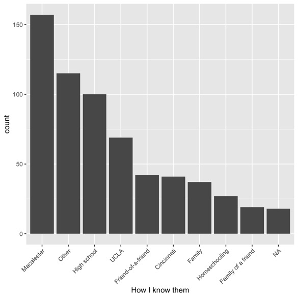
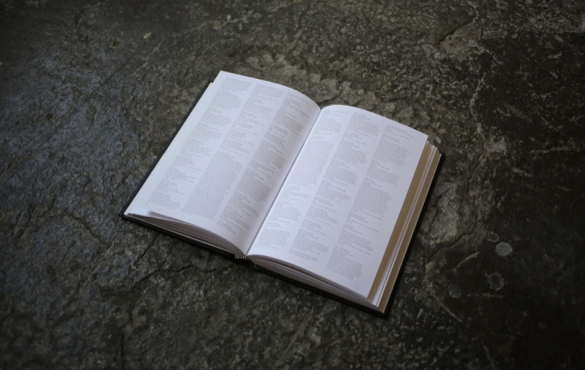
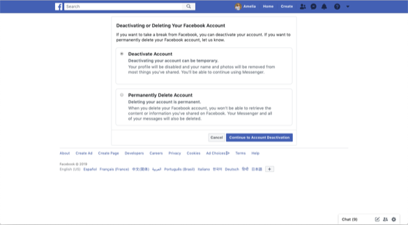
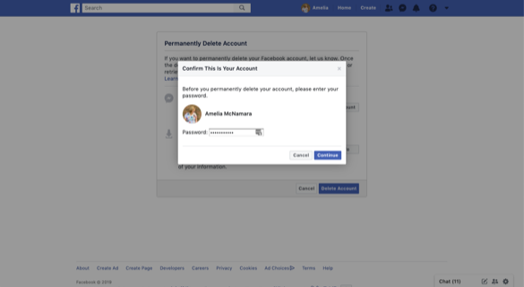

I recently took the plunge and deleted my Facebook account. This was a big decision for me, and I know other people are thinking about doing the same. So, I want to detail why I decided to delete my account, how I prepared to do it while also saving my data, and the way I've felt since I took the plunge.

## Why I did it

I had been thinking about deleting my Facebook account for several years, because I spend a fair amount of time teaching and speaking about data ethics and algorithmic inequality (e.g., my 2017 Otelia Cromwell Day workshop, [Algorithmic Accountability](https://www.youtube.com/watch?v=qRT3334Szis)). If you are a Facebook user, you are probably at least vaguely aware the company doesn't always do the right thing. I can't cover everything they've done wrong, but here are a few things that come to mind:

-   In 2013, Facebook was letting advertisers take your data (including your likes and profile picture) [to include in ads to your friends](https://mashable.com/2013/09/05/facebook-ads-photo/). I became aware of this when I saw my dad's photo in an ad. After this was exposed, Facebook gave users the opportunity to opt out of this.
-   In 2014, Facebook [ran an experiment to manipulate emotions of users](https://www.forbes.com/sites/kashmirhill/2014/06/28/facebook-manipulated-689003-users-emotions-for-science/#692ba3cd197c). This experiment was done without the oversight of an Institutional Review Board (the administrative body that protects human subjects in university studies). As someone commented on twitter, ["*probably* nobody was driven to suicide"](https://twitter.com/niftyc/status/482925976251154432) by this experiment, but we don't know.
-   Facebook allowed [Cambridge Analytica to get information on "more than 50 million Facebook users,"](https://www.nytimes.com/2018/03/19/technology/facebook-cambridge-analytica-explained.html) which may have helped them manipulate the 2016 election.
-   In 2016, it was shown that [Facebook was letting housing advertisers discriminate by race](https://www.propublica.org/article/facebook-lets-advertisers-exclude-users-by-race), in violation of federal law. Facebook said they would fix the issue.
-   In 2017, [Facebook was still letting housing advertisers discriminate by race](https://www.propublica.org/article/facebook-advertising-discrimination-housing-race-sex-national-origin). Facebook said they would fix the issue.
-   In 2018, it was shown that [Facebook was letting job advertisers target only men](https://www.propublica.org/article/facebook-is-letting-job-advertisers-target-only-men), in violation of federal law. Facebook said they would fix the issue.
-   As of March 2019, [Facebook says "advertisers can no longer target users by age, gender and ZIP code for housing, employment and credit offers"](https://www.propublica.org/article/facebook-ads-discrimination-settlement-housing-employment-credit), but it took years for this change to be made.
-   Of course, Facebook is tracking you all over the web, not just while you're on their site. And, it seems clear they maintain [shadow profiles of people who don't have accounts](https://www.theverge.com/2018/4/11/17225482/facebook-shadow-profiles-zuckerberg-congress-data-privacy).
-   The thing that pushed me over the edge was Facebook saying they [wouldn't fact-check political ads](https://www.businessinsider.com/facebook-political-ads-fact-check-policy-explained-2019-11). In general, Facebook *does* fact-check ads, and uses a third-party fact checking service. But, they won't apply the same policy to political ads.

Facebook is essentially an ad company, and they develop their platform to keep you hooked enough to serve you more ads. Although Mark Zuckerberg already has a net worth of \~\$70 billion, he is still valuing making more money over doing the right thing. While most social networks operate on the same principles, other companies have left money on the table in order to do the right thing. For example, [Pinterest now blocks anti-vaccination searches](https://www.fastcompany.com/90396075/pinterest-is-escalating-its-fight-against-anti-vaxxers-as-measles-surge-in-the-u-s).

So, for my own personal sanity (less time looking at my phone!) as well as my principles (data companies should do good with data!) I decided to delete my account.

Even though I knew I was doing the right thing, it was still really hard. I was an extremely active Facebook user. From when I joined the site in 2006 until I deleted my account in 2019, I almost always had a Facebook tab open on my computer, and as soon as I had a smartphone I had the app on my phone. Looking back at RescueTime data, it appears I spent about 15 minutes a day on Facebook most days. I was actually surprised to see such a low number, because it felt like I was on Facebook all day. I would probably click on my Facebook tab at least once an hour.

Because I was so attached to Facebook, I didn't want to delete my account and lose all my data. So, instead of just hitting the button, I embarked on a journey to rescue the data I wanted to keep.

## How I did it

I didn't do any sort of tapering to my use. I posted a warning to my Facebook two weeks before I deleted my account, saying I was leaving the platform and giving people the opportunity to subscribe to my newsletter. The text of what I posted is [on my GitHub](https://github.com/AmeliaMN/deleting_facebook/blob/master/LeavingFacebook.txt) if you want to see what I wrote.

Throughout those two weeks I continued to use Facebook on both my computer and my phone. In fact, I might have been on Facebook even *more* during that time, as I worked my way through my friend list, reaching out to people and getting other contact methods.

My first move was to download all the data Facebook makes available to users through their Download Your Information tool. [Facebook has instructions on how to do this](https://www.facebook.com/help/1701730696756992?helpref=hc_global_nav). My main piece of advice is to think carefully about whether you want .html or .json files.

HTML is probably the most appropriate for most (non-programmer) people, because the HTML file structure makes it easy to browse through your data on your computer. The files kind of mimic the Facebook experience, so you can click on a file called `your_photos.html` and see a page with links to each of your Facebook photo albums. If you click through to an album, you will get a page with each photo and the associated comments on the picture. It's a nice interface.

However, the HTML file structures are nasty. I didn't see the JSON option, so I thought my only option was to use the HTML files. In order to parse out my friend list to a useful csv file, I had to use `rvest`. My code is [available on GitHub](https://github.com/AmeliaMN/deleting_facebook/blob/master/FacebookFriends.md) in case you find yourself in that same situation. But, to avoid this, I recommend getting at least some of your information in JSON format. Eventually, I downloaded all my data twice, once in each format.

Once I had the parsed csv file, I turned it into a Google Sheet. This is both a backup of my data and a centrally-accessible place to store it. (A side note-- I have put my Facebook data all over the cloud. This might seem counter-intuitive, but I'm not worried about an individual hacker accessing my data, I wanted to remove myself from Facebook using my data in their ad machine.)

Over the course of several days, I worked my way through my entire friend list (625 friends) and recorded some meta-data about them. I used Facebook as a sort of external brain for my social network. What is that person's married name? Facebook knows. Which of the two people with the same first name did I go to college with, and which one is the partner of my colleague? Facebook knows. I knew that once I lost the ability to go to friends' profiles to see their pictures and our list of mutual friends, I would lose a lot of my "memory" of them.

Friends' pictures and mutual friends don't come with your Facebook data download. I decided I didn't need all that data (which I could have scraped) but that I would go through and categorize each person with a "rank," a general way I knew them, and then any additional notes I would need in order to recall who they were.

My rank variable was a value from 1 to 4, with 1 being my very best friends and close family, and 4 being people I probably should have unfriended because we had almost no connection. It felt a little scummy to rank people like that, but I know Facebook probably had an algorithmically-generated score in the background already, to determine whose posts I saw most often. I went through my friend list in reverse order of becoming Facebook friends, and it was such an interesting exercise. A sort of Marie Kondo of the network. (As a side note, I loved [Tokimeki Unfollow](https://tokimeki-unfollow.glitch.me/), which is exactly that for your Twitter follows.)

After going through all my friends, here is the distribution of my friend rankings:

So interesting! It looks linear, and the numbers in each category seem to follow [Dunbar's number](https://en.wikipedia.org/wiki/Dunbar%27s_number). I have 18 people I characterized as 1s (my support clique and sympathy group), 86 who are 2s (my active network), and 202 who are 3s (my personal network).

It was also interesting to see how I knew people,

I was homeschooled as a child, so that covers the elementary and middle school years. Cincinnati was my first year of college, Macalester was where I transferred and finished my BA, UCLA was my PhD. I like the big categories of "friend of a friend" and "family of a friend." I used `forcats::fct_lump` to lump together small categories, because there were a lot of little categories that I'm less comfortable sharing with the wider internet! But again, cool insight.

Once I had my friend list in an accessible place, and notes to myself about how I knew people, I felt pretty comfortable with my data. But, there were still two more big things I wanted from Facebook that didn't come in their data download:

-   friends' birthdays
-   tagged photos of me

Facebook used to let users download their friends' birthdays to a local calendar. However, they recently [changed their policy](https://www.digitaltrends.com/news/facebook-removes-friends-birthday-export/), and that feature has been removed. I dug around online, and found a python scraper by [Mo Beigi](https://github.com/mobeigi) [on GitHub](https://github.com/mobeigi/fb2cal). As he warns, using this script made facebook temporarily suspend my account because of suspected security issues. However, this was a good reminder to change my Facebook password (something which happened repeatedly as I was working on scraping data). The script worked so well that I don't have a clear memory of it anymore!

Once I ran the scraper, I had a .ics file with all 625 Facebook friends' birthdays. However, I didn't want to add all of them to my calendar, just my 104 close friends. So, I had to parse the .ics file and filter out just those birthdays. This process was tricky, mostly because I couldn't make the `calendar` package work on the ics file I got from the scraper. Again, my code is [on GitHub](https://github.com/AmeliaMN/deleting_facebook/blob/master/parsing_birthdays.md), scroll down to get to the useful stuff.

One interesting insight from this process was that 21% of my close friends didn't have their birthdays on Facebook. I'd guess this is in response to the feeling that Facebook is too invasive with their data collection. So now I have a list of people who I need to ask for their birthday!

The most challenging part of my data-rescue endeavor was rescuing my tagged photos. Again, I was a very active Facebook user with hundreds of friends. Over the 13 years I was on the site, I posted a lot of photos (1781, in fact). It was nice to get them in my Facebook data download. But, I would guess that I have almost all those files elsewhere, on my computer or my phone. The Facebook albums give me a curated selection of photos, and they're batched into folders to make them easier to see. And of course, I also got the comments on my photos. But for the files themselves, not so useful.

What Facebook does not give you in your data download are your tagged photos. It considers them to be your friends' data, which I guess is fair. But, I wanted those photos! I had 878 tagged photos on Facebook, so going through them one by one and right-clicking to download didn't make sense. I looked into scrapers online, and found several in python. However, I wasn't able to get any of those scrapers to work. My suspicion is that Facebook changed their page structure to thwart those particular scrapers, and I'm not good enough at python to debug that.

So, [I wrote my own scraper in R](https://github.com/AmeliaMN/deleting_facebook/blob/master/FacebookPhotosOfYou.md). This scraper was very likely not the most efficient-- it used `RSelenium` to drive a browser, a `for` loop to click through each picture because I couldn't think of how to vectorize it, and the whole thing happened in real time (the browser was up and I got to watch it go through all the photos). In `RSelenium` I just grabbed the image urls, because I couldn't figure out how to do the download right there, and I used another `for` loop and the `curl` library to download the images after the fact. However, this scraping code has the advantage of being (I think) very easy to read, so if Facebook changes their page structure I'd guess it will be possible to adjust the code to work again.

Once I had my 1781 uploaded photos and 878 tagged photos on my computer, I decided I wanted some of them physically printed. Somehow, when those photos were on Facebook they felt "safe" and like I would have access to them forever. But once they were on my computer, even though they were backed up, they felt insecure. Of those \~2500 photos, I chose \~500 I wanted printed, and uploaded them to Shutterfly.

I did my initial order before I deleted my Facebook account, and was able to use Shutterfly's Facebook Connect feature to import some photos directly from my photo albums. However, tagged photos are again not available there, so I had to upload those manually.

When I got my order, I was pretty shocked to see what \~500 photos looks like in a stack.

Imagine 2500 photos! I bought myself a photo album with those plastic sleeves, and have been working on getting the photos in there. I've got a few more to go, mostly because Shutterfly sent my prints in random order. I uploaded them chronologically, but that is not how the order arrives. Luckily, they do automatically print metadata on the back of their photos, so some of my prints came with Facebook captions, some came with dates, and some came with file names on the back. I haven't spent enough time examining the pattern to be able to determine how those different pieces of metadata were chosen. But, they were all helpful when trying to remember when a photo was from.

As I've gone, I've tried to label the backs of photos with names and dates. However, this has proven to be pretty difficult! If I got to go back and do this again, I'd print and organize the photos before I deleted my Facebook account, because it became difficult to remember some names. If I'd still had my profile, I could have looked at who was tagged in a photo, or used my "external brain" to make connections with people who weren't tagged ("she's friends with Katie, let's go look at Katie and my mutual friends"). As it was, I ended up messaging people on other platforms to see if they could help me. Actually a pretty fun social activity, but it added to the challenge.

The exercise of printing and organizing 500 photos made me want to do a larger art project and physicalize all my Facebook data-- print all 2500 photos, and make all my Facebook comments and Messenger messages into a book, a la [Nicholas Felton](http://feltron.com/). Do you remember when he cataloged all communication for a year, and would print a book of all his communications with a particular person?

I think this is the one of communications with his girlfriend:

I was awed by the physicality of that data, but I'm sure my Facebook data would be even larger when printed.

We're getting a little out of order now, but one of the most important parts of the process is of course to delete you actual account! If you are leaving Facebook for the same reasons I was (abuse of data in support of ad revenue), you need to actually delete your account rather than deactivate it. If you deactivate your account, Facebook gets to [keep using](https://deletefacebook.com/deactivate/) your valuable data. (Of course, they might actually keep using it after you delete your account, but that would go against their Terms of Use.)

I posted my [initial announcement](https://github.com/AmeliaMN/deleting_facebook/blob/master/LeavingFacebook.txt) that I was leaving Facebook on October 8. The following two weeks were a flurry of activity, much of it documented above (plus, my job and normal life stuff...). On October 22, I went through the [deletion process](https://facebook.com/help/delete_account).

The first thing Facebook asks is if you really want to delete your account, or just deactivate it. The default is deactivate. I chose delete.

Then, you're given a warning, with the option to keep Messenger and to download your information. I had already decided to delete Messenger and downloaded my information twice (once as html and once as json). But, this step might slow you down again.

You have to enter your password to confirm your identity.

One final warning,

and you're deleted! (Well, not really, because they give you 30 days to change your mind, and if you log in during that time you have to restart the whole process!)

I was somewhat surprised that this was the last email I got from Facebook. I was expecting a flurry of "are you sure??" emails as the date of permanent deletion approached. But perhaps they have studied user behavior and realized that if you get this far you aren't going to change your mind.

## The way I feel

It's been more than two months since I have logged in to Facebook (and a month since my account was actually deleted) and I have been shocked by how little I have missed Facebook. There have been a handful of times I've been somewhere and felt bored, anxious, or awkward, and have reached for my phone hoping to open Facebook. But, that's about it. Unsurprisingly, I've been able to find other apps for that little twitch (something to work on in 2020!), so the lack of Facebook in particular hasn't bothered me. I do know that I'm missing out on things. I miss being able to see regular posts of my friends' kids (and, the kids of acquaintances who I probably can't reach out to asking for photos!). I miss seeing what my far-flung family is up to. I know I've missed a couple event invites, and certainly the "events around town" feature that exposed me to things I wouldn't have otherwise heard of.

It's been interesting to see how my social connections have changed. I've transitioned one of my best friends to Signal for messaging, after years of using Messenger. Signal isn't great for sharing photos, and we haven't found a perfect solution. Right now we're just sending emails with photo attachments. I've been getting more memes texted and emailed to me (several people have said, "I went to share it with you on Facebook and you weren't there!"). Overall, it seems like my connections have gotten more personal.

I've been talking to lots of people about my decision to delete my account, and a common refrain I hear from people is, "I could never delete *my* account because \[x\]." I know there are many great things about Facebook. It connects people with rare diseases across the globe, it gets used by parents to organize school-related events for children, and on and on. In particular, Facebook is a place for [emotional labor](https://www.theverge.com/2018/4/28/17293056/facebook-deletefacebook-social-network-monopoly), so it can be particularly hard for women and mothers to leave it. As Vicki Boykis has pointed out, leaving Facebook is [a luxury](http://blog.vickiboykis.com/2019/04/25/digital-noise/) that not everyone can afford.

Just because I deleted my account doesn't mean I'm judging you for not deleting yours. But, I would encourage you to think about whether you actually need it, or whether it just feels scary to go without. The more people who leave Facebook, the bigger a message we send that the platform can't abuse our desire for social connection to sell more ads at any cost.
