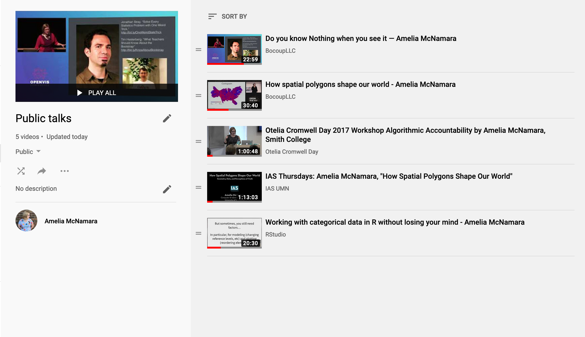

As with everything in life, there are no hard-and-fast rules for giving talks. But, I have a number of conventions I have developed over the years that I think make for clear(er) presentations. If you look at [talks I have given](https://www.youtube.com/playlist?list=PLik6fAQnSI91PMsa69RJcdKG4L4BiV5MX) you will see many of these things in practice. I started writing up some of these conventions for my Data Communication course, but realized there might be broader interest, so I'm making it a blog post.

## Intro slide

The intro slide should be eye-catching, because it is often up on the screen for longer than everything else. If you're giving a talk in person, it is sometimes on the screen for several minutes before you actually get up to give your talk, and for the first moments as you begin speaking.

I always try to find an engaging image on [flickr](https://www.flickr.com/) that is Creative Commons licensed. Google Image search also has a filter for CC licensed images, but I find the collection on flickr to be better.

My first image always bleeds across the entire slide. Evergreen Data has a [nice explanation](https://stephanieevergreen.com/bleeding-your-presentation/) of why it's good to bleed images wherever possible. To make slides look nice in high resolution, I always download the largest possible image from flickr.

Over the image, I put the title of my presentation, my name, and at least one way to contact me (usually my twitter handle).

## Introducing yourself

When you begin a presentation you are often nervous. I've developed a little "patter" I say at the beginning of any talk I give in person. It goes something like this: "I'm Amelia McNamara. I teach at the University of St Thomas in Minnesota, and I tweet at AmeliaMN. That's a double-entendre, because my last name is McNamara, and I live in Minnesota. I just tweeted a link to these slides, if you want to follow along." By the time I've said that (out of sheer force of habit) usually my nerves have calmed down, and I can begin with my content. (In classes, I find I almost always start with "hi folks! It's \[insert day of the week\]" for similar reasons.)

## Slide content

As Edward Tufte so effectively explains in [PowerPoint does Rocket Science](https://www.edwardtufte.com/bboard/q-and-a-fetch-msg?msg_id=0001yB), many technical presentations get bogged down by having too much information on the screen at once. I try my best to not include formulas on slides unless absolutely necessary, and reduce the number of words on slides as well.

You want your audience focusing on what you have to say, more than reading what's behind you. But, the slides should give them something to look at (maybe a pretty picture!) or an overview of the idea. I mostly present at conferences, and attendees like to take photos of slides and live-tweet them, so a slide that stands alone as a summary is a good way to encourage that.

Much like optimizing the data-ink ratio for a data visualization, you can often simplify a slide down to just its most important point by [iteratively removing information](http://stephanieevergreen.com/atomic-slide-development/). If you have an image on a slide, it should probably fill or almost-fill the slide. Same with a data visualization. When I include a ggplot image on a slide, I scale it so the visualization fills as much of the page as possible, often cutting off some of the white margins at the top and bottom. [The rule of thirds](https://stephanieevergreen.com/rottemplate/) can make your slides look more professionally-designed.

Evergreen Data has a [summary of the top four mistakes seen in conference presentations](https://stephanieevergreen.com/top-four-mistakes-seen-in-conference-presentations/). I disagree slightly with some of these mistakes-- I tend to include references on each slide, both hyperlinks to my image sources (to credit those CC-licensed image creators!) and links to original papers and other materials. However, I try to use a URL-shortening service whenever possible. Most commonly, I use [bit.ly](bit.ly) and customize the shortlinks to be readable. For example, I've made [bit.ly/AllHailTheAlgorithm](bit.ly/AllHailTheAlgorithm), which links to a piece of journalism by Al Jazeera called All Hail the Algorithm. It's a simple-enough link people watching can type it out as they watch, and again, I always distribute slides via twitter before I give a talk. St Thomas also has [a link shortener](https://link.stthomas.edu/login) if you want professional links with a St Thomas theme.

In general, slide animations are [usually distracting](https://stephanieevergreen.com/how-i-feel-about-slide-animations/), so it's best not to use them. However, if used carefully, animations can be very effective. One convention I've become slightly known for is embedding screen-capture videos into my slides, so I can show how a piece of software works or a piece of code executes ([example 1](https://youtu.be/hps9r7JZQP8?t=930), [example 2](https://youtu.be/uLcd6tRTUEY?t=314), [example 3](https://youtu.be/wn5larsRHro?t=718)). Crucially, while I'm showing a video, I never am hitting play on something with sound. Instead, it's a silent video and I get to talk over it live during my presentation.

## Building slide shows

There are a number of platforms for making decks of slides. The most common are probably PowerPoint, Keynote, and Google Slides. Personally, I use Keynote because it works the most seamlessly on a Mac.

If you want to work more reproducibly, there are options like Beamer (the way to make slides using LaTeX, a typesetting language for math) and variations on RMarkdown that knit to PDF or HTML slide shows. Personally, I don't think those platforms give me as much control as I want, and are a lot of overhead to learn. I only use them if I need to include a lot of typeset math, or (sometimes) code.

Even with code, I often use Keynote because it makes it easier to get things exactly the size I want. I do use the [reprex venue RTF](https://reprex.tidyverse.org/articles/articles/rtf.html) to get code highlighting to paste into Keynote.

In our new world of online education, I've found myself doing a lot of video-recorded presentations. I find full-screen presentations with just a voiceover to be pretty hard to stay attentive to, so I try to have a picture-in-picture of myself talking any time I do one of these recordings. At least on my computer, using the widescreen (16:9) format for my slides rather than standard (4:3) format allows me to get a nice picture-in-picture automatically when recording from Zoom, and easily when recording with a tool like [OBS](https://obsproject.com/) as well. I did a short [behind-the-scenes video](https://youtu.be/BtSeEeeVzk0) of how I record using Zoom.

## Giving the presentation

When I'm given the opportunity to present from my own computer, I always use the Keynote file and take advantage of all the settings I can pre-select (I have my presenter view customized, I know what will happen to my videos when I click, etc).

If I have to use someone else's computer, I export my slides to PDF and use the static slides for my presentation. Sometimes I will "print each stage of builds" if I've designed some type of buildable slide (text appearing on a slide, for example). This will end up creating more pages for my PDF, but is nicer while I present.

I also always export to PDF to share slides with others, and for that usecase I do **not** "print each stage of builds." People coming to my twitter or website for a copy of my slides are mostly skimming for links and takeaways, they don't need the entire build-up of the presentation.

As part of the [fast-talking R mafia](https://twitter.com/_inundata/status/748681351864283136), the thing I am reminding myself the most often while I speak is "slow down" (unless I'm giving a lighting talk where I [whiz through 30 slides in 5 minutes](https://resources.rstudio.com/rstudio-conf-2020/lightning-talk-dr-amelia-mcnamara)). It's good to build in some places to pause as you speak, to give your audience a chance to process. When you finish talking about a slide, that can be a good place to pause. Nicky Case uses [water breaks to good effect](https://youtu.be/uc5rfTkLzlY?t=142) for this purpose.

## Ending your talk

I have a strongly-held opinion that the last words out of your mouth at the end of a talk should always be "thank you." This makes it clear you are finished speaking, and also gives the audience a non-awkward opportunity to clap. If you say "any questions?" then the audience claps but it's a little awkward (can you tell I have social anxiety?). Hadley Wickham says [the key is to end with a firm statement (ie. no rising intonation) and then pause](https://twitter.com/hadleywickham/status/1220867364557934593?s=20), but coming up with something to say in a firm way that is not "thank you" is usually beyond me at the end of a talk. Just like having a patter to begin a talk, having one to end your talk also helps free your brain up to think about other things.

My last slide always says "thank you" in big letters, to remind me to say this. I also typically repeat the same image background as my original slide, and repeat how to contact me. Jenny Bryan and Mara Averick [disagree with me a little on this point](https://www.tidyverse.org/blog/2018/07/carpe-talk/), and say it's better to have a slide at the end with an overview and links. I think that's probably great, but I often need the "thank you" cue.

On that note, that's all I have to say about giving presentations. Thank you.
