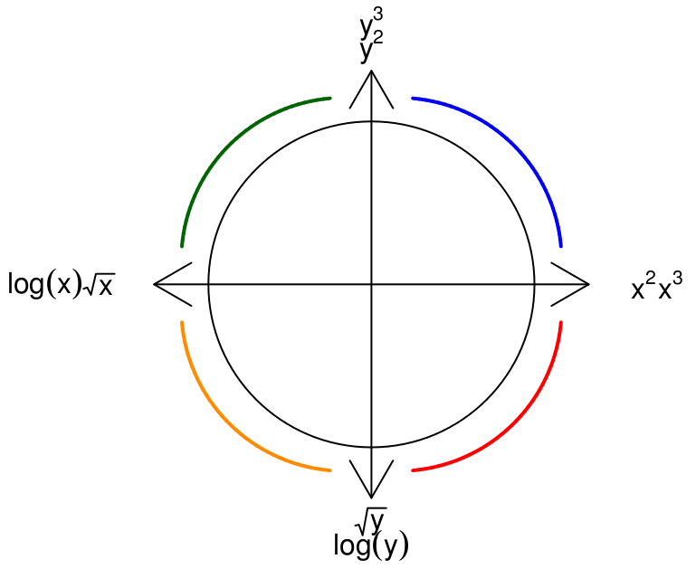

```{r, message=FALSE}
require(tidyverse)
```

Let's start by generating some random data, much like we did for the residuals lab. Like that lab, you don't need to understand the code here, we're mostly trying to illustrate concepts. Feel free to copy-paste this code. 

```{r}
# create a vector of the integers from 1 to 100
x = seq(from=1, to=100, by=1)
# generate a standard normal random variable
p = rnorm(1)
# raise x to the p^th power, and add some randomness
y = jitter(x^p, factor = length(x) / 2)
# Combine x and y into a data frame
Rand = data.frame(x,y)
```

Now, let's pretend that we don't know the value of $p$. That is, we know that $y$ is a function of $x$ raised to some power, but we don't know what that power is. Our interest, since this class is about building linear regression models, is to transform the $y$ variable so that we can figure out a linear regression model that works well. To do this, we are going to employ graphical techniques in an attempt to linearize the relationship between our data (which most likely is related in a non-linear fashion). 

#### Choose

* Plot y as a function of x. Does the relationship appear to be linear?

```{r, eval=FALSE}
ggplot(data=Rand) + geom_point(aes(y=y, x=x)) 
```

#### Fit

* Fit a linear regression model to the data, and generate diagnostic plots. 
```{r, eval=FALSE}
fm = lm(y ~ x, data=Rand)
summary(fm)
plot(fm, which=1)
plot(fm, which=2)
```

#### Assess

* Assess the fit. Is the linear model appropriate? Why or why not? 

### Tukey's Bulging Rule and Ladder of Powers

At this point you have two variables ($x$ and $y$) which are clearly related, but most likely not in an obvious linear pattern. We are going to **manually** apply transformations to the $y$ variable in an attempt to straighten out the relationship between $x$ and $y$. A helpful heuristic for applying transformations is given by Tukey's Bulging Rule and Ladder of Powers. 

The ladder gives us a set of transformations that correspond to an exponent, to which we are going to raise $y$. Here is the ladder:

Rung (exponent $q$)  | Step (transformation $f_q(y)$)
------------- | -------------
3 | $y^3$
2 | $y^2$
1 | $y$
$\frac{1}{2}$ | $\sqrt{y}$
0 | $\log{(y)}$
-1 | $-\frac{1}{y}$
-2 | $-\frac{1}{y^2}$
-3 | $-\frac{1}{y^3}$

Note that in general, we can think of moving up or down the ladder as raising $y$ to the power corresponding to the rung in the ladder $q$. However, this is not *literally* true (for example, $y^0 \neq \log{(y)}$!). The actual rule that will generate the ladder is:
$$
  f_q(y) = \begin{cases} 
    y^q & \text{if } q > 0 \\
    \log{y} & \text{if } q = 0 \\
    -y^{q} & \text{if } q < 0
    \end{cases}, \qquad \text{where }q\text{ is the rung of the ladder}
$$

The following diagram gives us insight as to how which transformations are likely to work. For example, suppose the pattern we see in the data is shaped similar to the blue line in the first quadrant of the diagram below. Then since both $x$ and $y$ are positive in that quadrant, we should try moving up the ladder in either $y$, $x$, or both. Many people find it easiest to think about transformations of the $y$ variable, so let's try that first. 



#### Application of Tukey's Rule: Manual Approach

* Use Tukey's Bulging Rule to determine an appropriate transformation of the $y$ variable. Create a new variable in your data frame containing the transformed $y$ values.

```{r}
# e.g. for a log transformation
Rand = Rand %>%
  mutate(y_new = log(y))
```

Note that you may have to try multiple transformations until you find something that works well. 

```{r, eval=FALSE}
ggplot(data=Rand) + geom_point(aes(y=y_new, x=x)) 
```

* Once you have something that looks roughly linear, re-fit the linear model, and assess it. Does the new model fit the assumptions for linear regression better than the old one? 

Recall that we are assuming that $y$ is a function of $x^p$, for some unknown value of $p$. If you have successfully straightened out your data, then you've applied the transformation corresponding to the $q^{th}$ rung of Tukey's ladder. Thus, your plot is actually showing $f_q(y)$ as a function of $x$. Since this plot is linear, it appears that $f_q(y) \sim x$. Suppose for a moment that $q$ is positive, so that $f_q(y) = y^q$. Then our model implies that
$$
  f_q(y) \sim x \Rightarrow y^q \sim x 
$$
But we are assuming that $y \sim x^p$. Thus, 
$$
  y^q \sim x \Rightarrow (x^p)^q = x \Rightarrow pq = 1 \Rightarrow p = 1/q
$$
This implies that if we were able to linearize our data using the transformation corresponding to the $q^{th}$ rung of Tukey's ladder, then $p$ should be roughly equal to the reciprocal of $q$. 

* Check the value of $p$. Does it makes sense with the transformation that you used? 

#### Application of Tukey's Rule: Automatic Approach using **manipulate** package

The previous method for applying transformations was labor-intensive, since we had to repeatedly compute the transformations and then re-plot them. We can take advantage of the **manipulate** functionality in RStudio to do this automatically. 

* Reset the $y$ values by executing the following code

```{r}
p = rnorm(1)
Rand = Rand %>%
  mutate(y = jitter(x^p, factor = length(x) / 2))
```

* Repeat the entire process above using the **manipulate** package. 

In order for this to work, you need to get a few functions into your environment. Copy-paste the following code as-is.   

```{r, eval=FALSE}

tukeyLadder = function (x, q=NULL) {
  if(is.null(q)) {
    return(x)
  }
  if (q==0) {
    x.new = log(x)
  } else {
    if (q < 0) {
      x.new = - x^q
    } else {
      x.new = x^q
    }
  }
  return(x.new)
}

tukeyPlot = function (x, y, q.y, q.x=1, ...) {
  y.new = tukeyLadder(y, q.y)
  x.new = tukeyLadder(x, q.x)
  y.center = mean(y.new, na.rm=TRUE)
  x.center = mean(x.new, na.rm=TRUE)
  x.bottom = 0.1 * (max(y.new) - min(y.new)) + min(y.new)
  y.left = 0.1 * (max(x.new) - min(x.new)) + min(x.new)
  xyplot(y.new ~ x.new
    , panel = function(x,y,...) {
      panel.xyplot(x,y, pch=19, alpha=0.5, cex=2)
      panel.text(y.left, y.center, paste("q.y =", q.y), col="red", cex=2)
      panel.text(x.center, x.bottom, paste("q.x =", q.x), col="red", cex=2)
    }
  )
}
```

Now that you have those plotting functions accessible, you can run the following code and move the slider to best linearize the data.
```{r, eval=FALSE}
require(manipulate)
manipulate(
  with(Rand, tukeyPlot(x, y, q.y))
  , q.y = slider(-3, 3, step=0.25, initial=1)
)
```
 * How does your result compare with the new value of $p$? Does the result accord with Tukey's Bulging Rule and Ladder? 
 
### Real Data

In the previous exercise, we fabricated data using the relationship $y = x^p$. Next, let's look at some real data, where the relationship between $y$ and $x$ is truly unknown. 

* Load the **SpeciesArea** dataset from the textbook's discussion of transformations. 

```{r}
require(Stat2Data)
data(SpeciesArea)
```

* Plot the number of species as a function of the area of the island. 

```{r}
ggplot(data=SpeciesArea) + geom_point(aes(y=Species, x=Area)) 
```

* Try to use Tukey's Bulging Rule and Ladder, and the **manipulate** function to linearize the data. This time, we have sliders to transform both the **Species** and the **Area** variables. Try moving one and then the other. Does it work? Why or why not? 

```{r, eval=FALSE}
manipulate(
  with(SpeciesArea, tukeyPlot(Area, Species, q.y, q.x))
  , q.y = slider(-3, 3, step=0.25, initial=1)
  , q.x = slider(-3, 3, step=0.25, initial=1)
)
```

* Try to transform the data by taking the $\log$ of **both** the response and explanatory variable. Does that work better? How do you know?

```{r, eval=FALSE}
ggplot(data=SpeciesArea) + geom_point(aes(y=log(Species), x=log(Area))) 
```


#### A few data wranging comments
Above, we used the `dplyr` `mutate()` command to make a new variable in our data. We'll be talking more about dplyr commands in the future, but you might need `mutate()` and `slice()` for your homework. Let's look at an example using `slice()`


```{r}
miniSpecies = SpeciesArea %>%
  slice(-c(1:10))
```

You also might need one more plotting idea for the homework. That is making different colors on a plot! Let's add a new variable to `SpeciesArea` to color by.

```{r}
SpeciesArea = SpeciesArea %>%
  mutate(BigSmall = ifelse(Area>1500, "Big", "Small"))
```

In `ggplot2`,

```{r}
ggplot(SpeciesArea) + geom_point(aes(x=Area, y=Species, col=BigSmall))
ggplot(SpeciesArea) + geom_point(aes(x=Area, y=Species, shape=BigSmall))
```