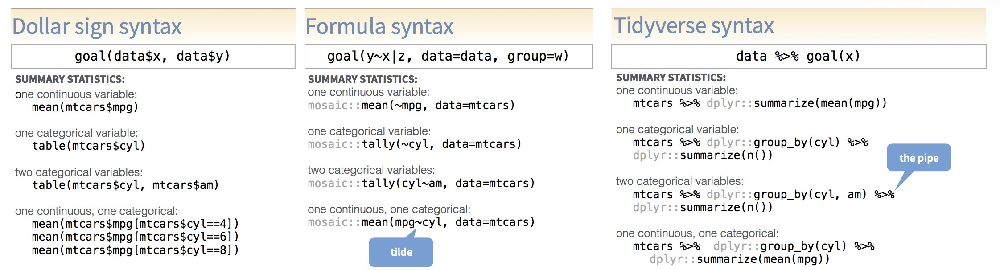
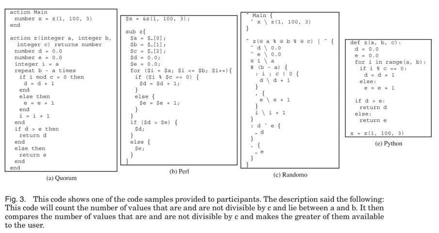
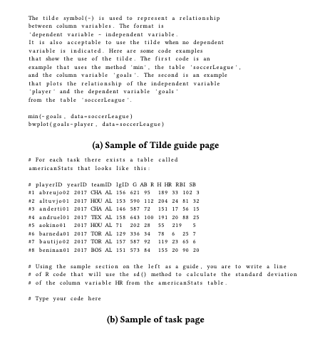
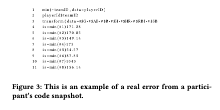

```{r setup, include=FALSE}
options(htmltools.dir.version = FALSE, warning = FALSE, message = FALSE, verbose = FALSE, htmltools.preserve.raw = FALSE)
knitr::opts_chunk$set(echo = TRUE, message = FALSE, warning = FALSE, fig.retina = 3)

# devtools::install_github("rstudio/fontawesome")
# devtools::install_github("ropenscilabs/icon")
library(xaringan)
library(fontawesome)
library(tweetrmd)
```


class: title-slide, left, top
background-image: url(img/comments.png)
background-size: contain
background-position: bottom left 


# `r rmarkdown::metadata$title`

### `r rmarkdown::metadata$author`
### `r rmarkdown::metadata$role`
### `r rmarkdown::metadata$institute`

[`r icon::fontawesome("twitter")` @AmeliaMN](https://twitter.com/AmeliaMN)  
[`r icon::fontawesome("github")` AmeliaMN](www.github.com/AmeliaMN)  
[slides]()


???

Hi, I'm Amelia McNamara. I'm an assistant professor at the University of St Thomas in Minnesota. I tweet at AmeliaMN, which is a double entendre because my last name is McNamara and I live in Minnesota. 

---
background-image: url(img/mpls-stp-8.5x11-DakotaMap.jpg)
background-size: cover
background-position: top left


.footnote[
 Dakota landmap by [Marlena Myles](https://marlenamyl.es/) 
]

???

Even though we're at a virtual conference, I want us to take a moment to consider the physical space we are each in, and the history of that space. The United States is built on land forcibly taken from Native Americans, and where I am physically located is no different. What is now called Minneapolis and St Paul was originally Dakota land, and continues to have a vibrant Native community. 

I chose this beautiful map of sites in the Twin Cities, labeled in the Dakota language, to show you where I'm physically grounded, and the idea of language is one I'm going to take into my talk.

---


.pull-left[
```{r, echo=FALSE, eval=TRUE, results='asis'}
include_tweet("https://twitter.com/AmeliaMN/status/1223042166580101120")
```
]
.pull-right[
# I am a massive R nerd. 
]

---
One of the killer apps that makes R so appealing when you're teaching reproducibility is RMarkdown. RMarkdown is a variant of Markdown.

.footnote[Learn [RMarkdown](https://rmarkdown.rstudio.com/)]

.pull-left[
```
# Pound signs make titles
```
Text is just text.

````
```{r}`r ''`
# code gets executed
library(palmerpenguins)
library(ggplot2)
data(penguins)
ggplot(penguins) + geom_histogram(aes(x=bill_length_mm))
```
````
]

.pull-right[
### Pound signs make titles
Text is just text.
```{r,  message=FALSE, warning = FALSE, fig.height=4, out.width = "80%", size='footnotesize'}
# code gets executed
library(palmerpenguins)
library(ggplot2)
data(penguins)
ggplot(penguins) + geom_histogram(aes(x=bill_length_mm))
```
]


---
class: center, middle
# This talk is not about RMarkdown 😭

---
class: center, middle
# But, it is about R! 🎉

--

# Specifically, about teaching R

---
# Speaking R

.center[
<iframe width="800" height="500"  src="https://www.youtube.com/embed/ckW9sSdIVAc?start=676" frameborder="0" allow="accelerometer; autoplay; encrypted-media; gyroscope; picture-in-picture" allowfullscreen></iframe>
]

.footnote[[Speaking R](https://www.youtube.com/watch?v=ckW9sSdIVAc&t=676s), useR! 2020 keynote by Amelia McNamara
]

???
Reading code out loud is important for learners

---
## Programming syntax/dialect/domain specific language (DSL)

> In programming, syntax refers to the rules that specify the correct combined sequence of symbols that can be used to form a correctly structured program using a given programming language. Programmers communicate with computers through the correctly structured syntax, semantics and grammar of a programming language.

## Most programming languages only have one correct syntax. R has many!


.footnote[Definition via [techopedia](https://www.techopedia.com/definition/3959/syntax)]

---
name: cheatsheet
class: center, middle
background-image: url(img/Syntax-cheatsheet.jpg)
background-size: contain

.footnote[
Syntax cheatsheet available from the RStudio [contributed cheatsheets](https://rstudio.com/resources/cheatsheets/#contributed-cheatsheets) page
]

---
class: middle

.footnote[
Syntax cheatsheet available from the RStudio [contributed cheatsheets](https://rstudio.com/resources/cheatsheets/#contributed-cheatsheets) page
]

???

Lots of debate in the stat ed community

Of course, practitioners really mix and match the syntaxes shown here, and more, when they are working. But, this has been useful to show students which "column" we are working in, and what the other approaches are. 

I'm interested in how the different syntaxes may impact learning, and whether they lead to different conceptions of data. 


---
# Palmer Penguins

```{r}
library(palmerpenguins)
```

```{r, echo=FALSE, out.width='50%'}
knitr::include_graphics("img/lter_penguins.png")
```


.footnote[[Penguin data](https://github.com/allisonhorst/palmerpenguins) and [penguin art](https://github.com/allisonhorst/palmerpenguins/tree/master/man/figures) by [Allison Horst](https://twitter.com/allison_horst)
]


---
# Summary statistics three ways

**base**
```{r, echo=TRUE, eval=FALSE}
mean(penguins$body_mass_g[penguins$species == "Adelie"])
mean(penguins$body_mass_g[penguins$species == "Chinstrap"])
mean(penguins$body_mass_g[penguins$species == "Gentoo"])

tapply(penguins$body_mass_g, penguins$species, mean)
```

**formula**
```{r, echo=TRUE, eval=FALSE}
mean(body_mass_g ~ species, data = penguins)
```

**tidyverse**
```{r, echo=TRUE, eval=FALSE}
penguins %>%
  group_by(species) %>%
  summarize(mean(body_mass_g))
```


???
The GAISE guidelines say "Give students experience with multivariable thinking." [GAISE guidelines](https://www.amstat.org/asa/education/Guidelines-for-Assessment-and-Instruction-in-Statistics-Education-Reports.aspx), for PreK-12, and college. Harder in base!

---
# Scatterplot three ways

**base**
```{r, echo = TRUE, eval=FALSE}
plot(penguins$flipper_length_mm, penguins$bill_length_mm)
```

**formula**
```{r, echo = TRUE, eval=FALSE}
xyplot(bill_length_mm ~ flipper_length_mm, data = penguins)

gf_point(bill_length_mm ~ flipper_length_mm, data = penguins)
```

**tidyverse**
```{r, echo = TRUE, eval=FALSE}
ggplot(penguins) +
  geom_point(aes(x = flipper_length_mm, y = bill_length_mm))
```


---
# Sets of scatterplots three ways


**base**
```{r, echo = TRUE, eval = FALSE}
par(mfrow = c(1, 3))
plot(penguins$flipper_length_mm[penguins$species == "Adelie"], penguins$bill_length_mm[penguins$species == "Adelie"])
plot(penguins$flipper_length_mm[penguins$species == "Chinstrap"], penguins$bill_length_mm[penguins$species == "Chinstrap"])
plot(penguins$flipper_length_mm[penguins$species == "Gentoo"], penguins$bill_length_mm[penguins$species == "Gentoo"])
# apply solution?
```

**formula**
```{r, echo = TRUE, eval=FALSE}
gf_point(bill_length_mm ~ flipper_length_mm | species, data = penguins)
```

**tidyverse**
```{r, echo = TRUE, eval=FALSE}
ggplot(penguins, aes(x = flipper_length_mm, y = bill_length_mm)) +
  geom_point() +
  facet_grid(~species)
```

---
```{r, echo=FALSE, out.width='95%', fig.cap="Figure from Stefik's paper, comparing Quorum, Perl, Randomo, and Python code for the same task"}

```


.footnote[C-style languages (Perl, Java) were no better than Randomo, but non-C-style (Quorum, Python, Ruby) were. <br> Andreas Stefik and Susanna Siebert.  An Empirical Investigation into Programming Language Syntax. [ACM Transactions on Computing Education, Volume 13 Number 4, 2013](https://dl.acm.org/doi/10.1145/2534973) ]

???

For this article, we conducted **four empirical studies on programming language syntax** as part of a larger analysis [...] two surveys [...] on the intuitiveness of syntax,  two studies on the accuracy rates of novices using a total of six programming languages: Ruby, Java, Perl, Python, Randomo, and Quorum. Randomo was designed by randomly choosing some keywords from the ASCII table (a metaphorical placebo). To our surprise, **we found that languages using a more traditional C-style syntax** (both Perl and Java) **did not afford accuracy rates significantly higher than a language with randomly generated keywords**, **but that languages which deviate** (Quorum, Python, and Ruby) **did**.

---

.pull-left[
```{r, echo=FALSE, out.width='150%', fig.cap="Figure from Rafalinski's paper, showing the setup to the experiment for the formula syntax, and an example of the task"}

```
]
.pull-right[
```{r, echo=FALSE, out.width='150%', fig.cap="Figure from Rafalinski's paper, showing a variety of student errors for the task in the previous figure."}

```
]


.footnote[Timothy Rafalski, P. Merlin Uesbeck, Cristina Panks-Meloney, Patrick Daleiden, William Allee, Amelia McNamara, Andreas Stefik. "A Randomized Controlled Trial on the Wild Wild West of Scientific Computing with Student Learners." [ICER '19: Proceedings of the 2019 ACM Conference on International Computing Education Research July 2019 Pages 239–247](https://dl.acm.org/doi/10.1145/3291279.3339421)
]

???
tl;dr they (we?) didn't find a difference between base, formula, and tidyverse syntaxes in completion time or number of errors (qualitative or interpreter)

When I look at the results, what I see is a lot of misunderstanding about variables and dataframes. 

No teaching!

 
---
class: big-bullet
# Choosing syntax

There is debate in the statistics education community about which syntax is best to teach, particularly for the "first course." All three syntaxes have their proponents, but the folks most interested in pedagogy tend to argue about whether formula or tidyverse is best. 

- the base first philosophy typically comes from people who were taught base first, often using [the man page for R](https://cran.r-project.org/doc/manuals/r-release/R-intro.html). Jeff Leek has [argued for the use of base graphics](https://simplystatistics.org/2016/02/11/why-i-dont-use-ggplot2/) but very few arguments for base are grounded in pedagogy
- tidyverse first philosophy, as espoused by David Robinson ([post](http://varianceexplained.org/r/teach-tidyverse/), and [talk](https://rstudio.com/resources/rstudioconf-2018/teach-the-tidyverse-to-beginners/)) and implicitly by Mine Cetinkaya-Rundel in her [Start with cake](https://datasciencebox.org/design-principles.html#start-with-cake) argument
- formula first philosophy, ["the third way"](https://www.r-bloggers.com/2017/07/options-for-teaching-r-to-beginners-a-false-dichotomy/), as laid out by Nick Horton. This philosophy led to the `mosaic` package, which Horton coauthored with [Randy Pruim](http://www.mosaic-web.org/ggformula/articles/ggformula-blog.html) and [Danny Kaplan](https://dtkaplan.github.io/SM2-bookdown/preface-to-this-electronic-version.html).  

---
class: big-bullet
# Choosing syntax

I've taught R **a lot**, including in introductory statistics labs. 
  - all base R
  - all formula
  - all tidyverse
    
When I teach a particular tool (or even just a particular syntax), I know I unconsciously modify the tasks to be easier to do in that tool. This makes it really hard to compare! 

---
class: big-bullet
# Another "experiment"
In Spring 2020, I had my first opportunity to teach introductory statistics labs at St Thomas. I couldn't decide which syntax to teach, so I thought  


---
class: big-bullet
# Another "experiment"
I decided to teach one lab completely in formula syntax, the other entirely in tidyverse. 

At the University of St Thomas, lab assignments are standardized across all labs (JMP, SPSS, Minitab, Excel, and R). This forced me to write my "pre-labs" to accomplish exactly the same tasks in both syntaxes. 

Received IRB approval to study this "experiment." (St Thomas IRB #1605810-1). 

Of course, Spring 2020 was a mess of a semester. So, I repeated the "experiment" in Fall 2020 (IRB #1605810-2). I'm still working on the data analysis, but I've realized it was more of a case study than a true experiment. 

---
class: big-bullet
# Experimental protocol

The two labs were randomized to be tidyverse or formula (coin flip at the beginning of the semester). 

I attempted to switch the order in which I wrote the pre-labs and recorded the videos. This did not always happen. 

Students had to consent to participate in the pre- and post-tests. 

---
class: big-bullet
# Materials

If you want to dig into all the materials, there is a [page on my website](https://www.amelia.mn/STAT220labs) that summarizes the content in each of the labs, and links to the appropriate RMarkdown document as well as the YouTube video to follow along with. 

All the RMarkdown documents for the pre-labs are available on [my GitHub](https://github.com/AmeliaMN/STAT220-labs), and the videos are in two playlists, one for the  [formula labs](https://www.youtube.com/playlist?list=PLik6fAQnSI90bHK9fapPS-eZCUhgROh6S) and the other for the [tidyverse labs](https://www.youtube.com/playlist?list=PLik6fAQnSI93eBVuAONFBCVdOd7VFhKQX)

---
# Prior experience

```{r, echo = FALSE, fig.height = 8, fig.width = 16}
library(tidyverse)
pre <- read_csv("../data/pre-for-slides.csv")
ggplot(pre) + geom_bar(aes(x=Q1)) + facet_wrap(~Section) + xlab("Do you have any prior programming experience?") + ylab("") + scale_y_continuous(breaks =seq(from = 0, to = 10, by = 2)) + theme(text = element_text(size = 20)) 
```

???
C++, Java, Javascript, HTML

---
```{r prepost, echo=FALSE, fig.height = 9, fig.width = 16}
prepost_pos <- read_csv("../data/prepost_pos.csv")
prepost_neg <- read_csv("../data/prepost_neg.csv")
prepost_neu <- read_csv("../data/prepost_neu.csv")
likert_palette <- c("1 - strongly disagree" = "#D8B365", "2" = "#DFCCA5", "3 - neutral" = "grey90", "4" = "#A0CDC9", "5 - strongly agree" = "#5AB4AC")
ggplot(prepost_pos, aes(x = type, y = prop, fill = feeling)) +
  geom_col() +
  geom_col(data=prepost_neg) +
  coord_flip() + 
  theme_bw() +
  theme(axis.ticks.x = element_blank(),
        axis.ticks.y = element_blank(),
        text = element_text(size = 24)) +
  xlab("") +
  ylab("Percentage") +
  scale_y_continuous(limits = c(-1, 1), breaks = seq(from=-1, to = 1, by = 0.5), labels = c(100, 50, 0, 50, 100)) +
  scale_fill_manual(values = likert_palette) +
  facet_grid(skill~Section)
```

???
Pre/post data not that useful

---
class: big-bullet
# Other data

I also have data on viewership on YouTube for the period of my class, and [rstudio.cloud](https://rstudio.cloud) useage analytics. That analysis is still in progress. 


---
class: big-bullet
# Topics

Standardized labs meant I couldn't change what I asked based on syntax. The lab topics were:

- Describing data
- Categorical variables
- Quantitative variables 
- Correlation and regression
- Bootstrap intervals
- Randomization tests
- Inference for a single sample
- Inference for two samples
- ANOVA
- Chi-square
- Inference for regression

---
class: big-bullet
# Materials and guidance

- "all the R you need" cheatsheet for the semester
- weekly pre-lab, in RMarkdown
- pre-lab YouTube video
- real lab assignment, in RMarkdown
- synchronous class time on Zoom

???
Each week, the students were given an RMarkdown document that contained the "pre-lab" for the week. This pre-lab covered the material needed for the real lab (e.g., descriptive statistics and visualizations for one categorical variable). They were also sent a link to the associated YouTube video(s). Distribution was via Canvas. 


Students were expected to work through the pre-lab material asynchronously on their own. Ahead of the synchronous class time, another RMarkdown document with the real lab assignment would become available. 

During our scheduled synchronous time on Zoom, I would answer any questions from the pre-lab, help everyone at least load the data for the real lab, and give them any lab-specific tips. Typically this took less than 20 minutes. I was available for the rest of the synchronous time to answer questions live. Students would work in breakout rooms, or leave the Zoom meeting and come back if they had a question. 

Submitted labs needed to be "knitted" HTML files, not the source RMarkdown. Since we were working on rstudio.cloud, one source of confusion was moving files between the cloud and a student's local computer. 

---
# All the R you need: tidyverse
```{r, eval=FALSE}
library(Lock5Data)
library(tidyverse)
library(infer)

# one categorical
ggplot(penguins) + geom_bar(aes(x = species))

# two categorical
ggplot(penguins) + geom_bar(aes(x = island, fill = sex))
ggplot(penguins) + geom_bar(aes(x = island, fill = sex), position = "dodge")

# one categorical
penguins %>%
  group_by(island) %>%
  summarize(n = n()) %>%
  mutate(prop = n / sum(n))

# two categorical
penguins %>%
  group_by(island, sex) %>%
  summarize(n = n()) %>%
  mutate(prop = n / sum(n))
```

---
# All the R you need: formula

```{r, eval=FALSE}
library(Lock5Data)
library(mosaic)
library(ggformula)

# one categorical
gf_bar(~species, data = penguins)

# two categorical
gf_bar(~species, fill = ~sex, data = penguins)
gf_bar(~species, fill = ~sex, data = penguins, position = "dodge")

# one categorical
tally(~island, data = penguins, format = "proportion")

# two categorical
tally(~island | sex, data = penguins, format = "proportion")
```

---
# Bootstrap: tidyverse
```{r, echo=FALSE}
library(palmerpenguins)
data(penguins)
```
.pull-left[
```{r tidyboot, echo=TRUE, eval=FALSE}
library(tidyverse)
library(infer)
boot <- penguins %>%
  specify(response = flipper_length_mm) %>%
  generate(reps = 1000, type = "bootstrap") %>%
  calculate(stat = "mean")
ggplot(boot) + geom_histogram(aes(x = stat))
```
]
.pull-right[
```{r tidyboot-out, ref.label="tidyboot", echo = FALSE}
```

]

---
# Bootstrap: formula
.pull-left[
```{r formulaboot, echo=TRUE, eval=FALSE}
library(mosaic)
boot <- do(1000) * mean(~flipper_length_mm,
  data = resample(penguins), na.rm = TRUE,
)
gf_histogram(~mean, data = boot)
```
]
.pull-right[
```{r formulaboot-out, ref.label="formulaboot", echo = FALSE}
```

]

---
class: big-bullet
# formula: what was easy?
Introducing `lm()`, `aov()`, `chisq.test()`, etc after students were familiar with `mean()`, `cor()`, `gf_point()`, etc. (thanks, `mosaic` and `ggformula`!)

```{r, eval=FALSE}
mean(bill_length_mm ~ island, data = penguins, na.rm = TRUE)
cor(bill_length_mm ~ body_mass_g, data = penguins, use = "complete.obs")
gf_point(bill_length_mm ~ body_mass_g, data = penguins)
lm(bill_length_mm ~ body_mass_g, data = penguins)
aov(bill_length_mm ~ island, data = penguins)
```

Inference using distributional approximations, `prop.test()`, `t.test()`
```{r, eval=FALSE}
prop.test(sex ~ island, data = penguins)
t.test(body_mass_g ~ sex, data = penguins)
```

---
class: big-bullet
# formula: what was hard?
Dealing with `NA` values
```{r, eval = FALSE}
mean(bill_length_mm ~ island, data = penguins, 
     na.rm = TRUE)
cor(bill_length_mm ~ body_mass_g, data = penguins, 
    use = "complete.obs")
```

```{r, error = TRUE}
mosaic::prop.test(sex~island, data = penguins)
```

Data wrangling. Nothing specifically in formula syntax to do this, used `dplyr` verbs without the pipe,
```{r, eval=FALSE}
filter(penguins,  body_mass_g>6000)
```

---
class: big-bullet
# formula: what was hard?

Getting long variable names correct.

```{r, eval = FALSE}
lm(highest_year_of_school_completed ~ highest_year_school_completed_spouse,
  data = GSS
)
```
    
---
class: big-bullet
# tidyverse: what was easy? 
Explaining concepts from bootstrap and randomization (thanks, `infer`!)

```{r, eval=FALSE}
penguins %>%
  specify(response = flipper_length_mm) %>%
  generate(reps = 1000, type = "bootstrap") %>%
  calculate(stat = "mean")
```

Dealing with `NA` values

```{r, eval=FALSE}
penguins %>%
  drop_na(bill_depth_mm) %>%
  summarize(
    mean = mean(bill_depth_mm),
    median = median(bill_depth_mm))
```

---
class: big-bullet
# tidyverse: what was easy? 

Data wrangling when it came to end-of semester projects

```{r, eval=FALSE}
penguins %>%
  drop_na(island) %>%
  filter(island != "Biscoe") %>%
  t_test(response = bill_depth_mm, explanatory = island)
```


---
class: big-bullet
# tidyverse: what was hard?
Summary statistics
```{r, eval=FALSE}
penguins %>%
  group_by(island) %>%
  summarize(n = n()) %>%
  mutate(prop = n / sum(n))

penguins %>%
  drop_na(bill_depth_mm) %>%
  summarize(
    mean = mean(bill_depth_mm),
    median = median(bill_depth_mm))
```

---
class: big-bullet
# tidyverse: what was hard?

Explaining the difference between the `%>%` and `+` operators
```{r, eval=FALSE}
penguins %>%
  group_by(island) %>%
  summarize(n = n()) %>%
  mutate(prop = n / sum(n))

ggplot(penguins) + geom_bar(aes(x = island))
```

---
class: big-bullet
# tidyverse: what was hard?
Inconsistency when we got to modeling, `lm()` and `aov()`
```{r, eval=FALSE}
penguins %>%
  group_by(island) %>%
  summarize(mean(bill_length_mm))

penguins %>%
  drop_na(bill_length_mm, body_mass_g) %>%
  summarize(cor(bill_length_mm, body_mass_g))

lm(bill_length_mm ~ body_mass_g, data = penguins)
aov(bill_length_mm ~ island, data = penguins)
```

---
class: big-bullet
# tidyverse: what was hard?
Inference using distributional approximations. When I taught the class in spring 2020, `infer` had `chisq_test()`, but not `prop_test()` or `t_test()`. By fall 2020, `prop_test()` and `t_test()` were there!  But, [I found even more edge cases](https://github.com/tidymodels/infer/issues/343). Looks like that issue has now been closed.  

Tab completion for `infer` related things, 

```{r, eval=FALSE}
ggplot(boot) + geom_histogram(aes(x = stat))
```


---
class: big-bullet
# overall
## easy

- explaining RMarkdown
- debugging with hands off the keyboard (even after moving online!)

## hard

- **variables** Students would struggle to understand that `species` was the variable, not `Adelie`, `Chinstrap` and `Gentoo` (levels). 
- moving files from a local computer to RStudio Cloud
- filepaths
- students using the internet to troubleshoot (too much inconsistency online)

???
Overall, the formula syntax felt more consistent. The folks who work on mosaic, ggformula, etc., have made sure the entire introductory statistics curriculum can be accomplished using that syntax. Those students didn't have to see any dollar signs, and almost every single thing they saw used a formula. 

The tidyverse syntax feels more "useful" to me (bigger use in the wider community), but isn't quite ready for primetime when it comes to the entire intro stats curriculum. 

But, I didn't end up deciding that one was "better" and I'm going to teach both again in the fall. 

---

```{r, ref.label="prepost", echo = FALSE, fig.height = 9, fig.width = 16}
```

---
```{r, echo=FALSE, fig.width = 16}
post <- read_csv("../data/post_for_slides.csv")
post <- post %>%
  mutate(Q23 = as_factor(Q23)) %>%
  mutate(Q23 = fct_relevel(Q23, "About what I expected -- in a good way", "Not what I expected -- in a good way", "About what I expected -- in a bad way", "Not what I expected -- in a bad way"))
post %>%
  drop_na(Q23) %>%
  ggplot() + geom_bar(aes(Q23)) + facet_wrap(~Section) + xlab("") + coord_flip() + theme(text = element_text(size = 20)) 
```

---

```{r, echo=FALSE, fig.width = 16}
post %>%
  drop_na(Q19) %>%
  filter(Q19 != "Click to write Choice 3") %>%
  ggplot() + geom_bar(aes(Q19)) + facet_wrap(~Section) + xlab("Would you have preferred to learn the other syntax?") + ylab("")
```

---
class: big-bullet
# Why or why not?

- "I've heard that formula was more straightforward"
- "I thought the syntax that I learned worked well"
- "I really enjoyed tidyverse, it was super easy to learn, and I liked the simplicity of the syntax" 
- "Tidy, is well tidy. When looking online the other syntax seemed more complex/abnormal"

- "I have no idea what the differences are, so I don't really know how to answer this question."
- "I'm not sure of the difference and I had 0 experience of coding or using anything like R so I didn't have a preference as to which one I learned."
- "I'm not sure I wish we got to experience both so we could compare, maybe learn one for one half of the semester and the other for the other half?"

---
class: big-bullet
# If I could do it over again

Maybe show the students some of the other syntax? 

~~"I wish we got to experience both so we could compare, maybe learn one for one half of the semester and the other for the other half?"~~ I wouldn't do this! But, could have shown them a little in the survey... 

Ask better questions in my survey. 


---
class: big-bullet
# So what? 

I'm still not sure which syntax I would recommend people to use. 

Overall, the formula syntax felt more consistent. The folks who work on `mosaic` and `ggformula` have made sure the entire introductory statistics curriculum can be accomplished using that syntax. Those students didn't have to see any dollar signs, and almost every single thing they saw used a formula. 

The `tidyverse` syntax feels more "useful" to me (bigger use in the wider community), but it hasn't been given the same level of thought when it comes to the entire intro stats curriculum. 

---
class: center, middle

# Be consistent!

